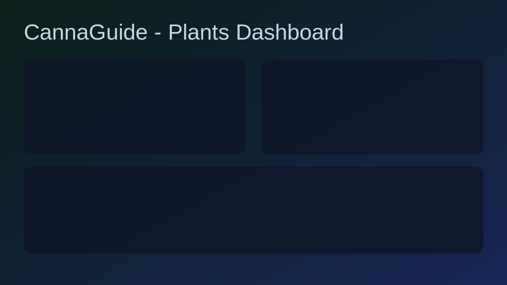

<!-- 
This README file supports two languages.
- English version is first.
- Deutsche Version (German version) follows below.
-->

# 🌿 CannaGuide 2025 (English)
[](https://deepwiki.com/qnbs/CannaGuide-2025)

[](https://opensource.org/licenses/MIT)
[](https://github.com/qnbs/CannaGuide-2025/releases)
[](https://github.com/qnbs/CannaGuide-2025)
[]()
[](https://ai.google.dev/)
[]()
[]()
[]()
[]()
[](https://ai.google.dev/)

**The Definitive AI-Powered Cannabis Cultivation Companion**

CannaGuide 2025 is your definitive AI-powered digital co-pilot for the entire cannabis cultivation lifecycle. Engineered for both novice enthusiasts and master growers, this state-of-the-art **Progressive Web App (PWA)** guides you from seed selection to a perfectly cured harvest. Simulate grows with an advanced VPD-based engine, explore a vast library of 700+ strains with a powerful genealogy tracker, diagnose plant issues with a photo, breed new genetics in the lab, plan equipment with Gemini-powered intelligence, monitor your room with live ESP32 sensors, and master your craft with an interactive, data-driven guide.

**Live App (GitHub Pages):** https://qnbs.github.io/CannaGuide-2025/

---

## Table of Contents

- [⭐ Project Philosophy](#-project-philosophy)
- [�️ Screenshots](#️-screenshots)
- [�🚀 Key Features](#-key-features)
  - [1. The Grow Room (`Plants` View)](#1-the-grow-room-plants-view)
  - [2. The Strain Encyclopedia (`Strains` View)](#2-the-strain-encyclopedia-strains-view)
  - [3. The Workshop (`Equipment` View)](#3-the-workshop-equipment-view)
  - [4. The Library (`Knowledge` View)](#4-the-library-knowledge-view)
  - [5. The Help Desk (`Help` View)](#5-the-help-desk-help-view)
  - [6. The Command Center (`Settings` View)](#6-the-command-center-settings-view)
  - [7. Platform-Wide Features](#7-platform-wide-features)
- [💻 Technical Deep Dive](#-technical-deep-dive)
- [🔒 Security & DSGVO/GDPR](#-security--dsgvogdpr)
- [🤖 Multi-Provider AI (BYOK)](#-multi-provider-ai-byok)
- [🏁 Getting Started (User Guide)](#-getting-started-user-guide)
- [🛠️ Local Development (Developer Guide)](#️-local-development-developer-guide)
- [📦 Distribution Targets](#-distribution-targets)
- [🔐 Gemini BYOK (Complete Guide)](#-gemini-byok-complete-guide)
- [🚀 GitHub Pages Deployment](#-github-pages-deployment)
- [🤔 Troubleshooting](#-troubleshooting)
- [🤖 Development with AI Studio & Open Source](#-development-with-ai-studio--open-source)
- [🤝 Contributing](#-contributing)
- [🗺️ Roadmap](#️-roadmap)
- [⚠️ Disclaimer](#️-disclaimer)
- [Deutsche Version](#-cannaguide-2025-deutsch)

---

## 🖼️ Screenshots

| Plants Overview | AI Mentor Chat |
|:---:|:---:|
|  |  |

> More screenshots coming soon — contributions welcome!

---

## ⭐ Project Philosophy

CannaGuide 2025 is built upon a set of core principles designed to deliver a best-in-class experience:

> **Offline First**: Your garden doesn't stop when your internet does. The app is engineered to be **100% functional offline**. All actions (like logging watering or adding notes) performed while offline are automatically queued and synced in the background via the browser's SyncManager API once your connection is restored. When Gemini AI is unreachable, a **local AI fallback service** generates heuristic-based plant advice so you're never left without guidance. All your data, notes, and AI archives are stored locally and accessible anytime, anywhere.

> **Performance is Key**: A fluid, responsive UI is non-negotiable. Heavy lifting, like the complex, multi-plant simulation, is offloaded to a dedicated **Web Worker**, ensuring the user interface remains smooth and instantaneous at all times. Large strain lists leverage **virtualized rendering** (via `useVirtualizer`) to maintain 60fps scrolling even with 700+ items.

> **Data Sovereignty**: Your data is yours, period. The ability to **export and import your entire application state** as a single file gives you complete control, ownership, and peace of mind for backups or device migration. Share your curated strain collections with the community via **anonymous GitHub Gists** — one click to export, one link to import.

> **AI as a Co-pilot**: We leverage the Google Gemini API not as a gimmick, but as a powerful tool to provide **actionable, context-aware insights**. From diagnosing a sick plant from a photo to generating a custom equipment list, AI serves to genuinely assist the grower at every stage. A **RAG-powered journal search** ensures the AI contextualizes advice with your actual grow history.

> **Resilience & Recovery**: Corruption-proof architecture with **safe recovery** mechanisms that automatically detect and repair corrupted state, plus **archive capping** (100 mentor + 50 advisor responses per plant) to prevent unbounded IndexedDB growth.

---

## 🚀 Key Features

### 1. The Grow Room (`Plants` View)
Your command center for managing and simulating up to three simultaneous grows.

-   **Advanced Simulation Engine**: Experience a state-of-the-art simulation based on **VPD (Vapor Pressure Deficit)** with altitude-corrected saturation pressure (Buck equation), biomass-scaled resource consumption, and a structural growth model that visually represents your plant's progress. Runs in a dedicated **Web Worker** for zero UI jank.
-   **Simulation Profiles**: Choose between `Beginner`, `Intermediate`, and `Expert` simulation profiles in the settings to adjust complexity and reveal advanced physics parameters.
-   **Grow Stats Dashboard**: A real-time overview panel that tracks **yield forecasts** (based on biomass and quality factors), **daily energy costs** (electricity + nutrients), **cumulative tracked costs**, and an **upcoming events timeline** with harvest ETAs and pending tasks.
-   **Live VPD Gauge**: A visual gauge displaying the current Vapor Pressure Deficit with color-coded ideal ranges for each growth stage — Seedling (0.4–0.8 kPa), Vegetative (0.8–1.2 kPa), Flowering (1.2–1.6 kPa), Late Bloom (1.4–1.8 kPa). Supports configurable **leaf temperature offset** and **altitude correction**.
-   **ESP32 Sensor Integration**: Connect your ESP32-based environmental sensors via **WebBluetooth** to feed live temperature and humidity data directly into the simulation. Reads GATT Environmental Sensing characteristics for lab-grade accuracy.
-   **AI-Powered Diagnostics**:
    -   **Photo Diagnosis**: Upload or capture a photo of your plant. EXIF/GPS metadata is automatically stripped before the image is sent to Gemini for an instant AI diagnosis, complete with immediate actions, long-term solutions, and preventative advice. Images are auto-compressed to optimize bandwidth.
    -   **Proactive Advisor**: Get data-driven advice from Gemini AI based on your plant's real-time vitals. All recommendations can be archived with full **CRUD** functionality. Archive is auto-capped at 50 entries per plant to keep storage lean.
    -   **Deep Dive Guides**: Generate comprehensive, AI-written deep-dive articles on specific topics (e.g., "terpene preservation", "defoliation timing") contextualized to your active plant's data.
-   **Comprehensive Logging**: Track every action — from watering and feeding to training, pest control, amendments, and photo documentation — in a detailed, filterable journal for each plant. The **RAG-powered grow log** enables the AI to search your entire journal history with token-based relevance ranking and recency boosting when generating advice.
-   **Grow Reminders (Push Notifications)**: Configure push notification reminders for critical events — VPD threshold alarms, watering schedules, and harvest windows. Uses the Periodic Background Sync API when available, with a built-in 4-hour cooldown and snooze tracking to prevent notification fatigue.
-   **Post-Harvest Simulation**: Manage the critical **Drying & Curing** phases with a dedicated interface that tracks humidity, burping schedules, terpene retention, chlorophyll degradation, and CBN conversion to achieve the perfect final product.
-   **What-If Experiments**: Run scenario-based comparisons (e.g., +2°C vs. -2°C, Topping vs. LST) on a clone of your plant to visualize the impact of different conditions over an accelerated simulation — without risking your real plants. View side-by-side results with difference summaries and interactive height/growth charts.

### 2. The Strain Encyclopedia (`Strains` View)
Your central knowledge hub, designed for deep exploration with **offline-first** access.

-   **Vast Library**: Access detailed information on **700+ cannabis strains** with intelligent **alias resolution** (~30 common name variations like "GSC" → "Girl Scout Cookies", "GG#4" → "Gorilla Glue" automatically mapped).
-   **Interactive Genealogy Tree**: Visualize the complete genetic lineage of any strain using a crash-proof, d3-powered tree with click-to-focus navigation. Use analysis tools to **highlight landraces**, trace Sativa/Indica parentage, **calculate the genetic influence** of top ancestors, and **discover known descendants**. The genealogy engine resolves aliases, handles landrace roots, and supports configurable depth collapsing for complex lineages.
-   **Entourage Effect Analysis**: Explore the science behind terpene-cannabinoid interactions with an evidence-based **terpene database** mapping pharmacological effects, cannabinoid receptor activity (CB1, CB2, TRPV1), and scientific citations.
-   **Chemotype Calculator**: Analyze any strain's cannabinoid and terpene profile to determine the **dominant chemotype**, profile classification, and tailored cultivation guidance.
-   **High-Performance Search & Filtering**: Instantly find strains with an IndexedDB-powered full-text search, alphabetical filtering, and an advanced multi-select filter drawer for THC/CBD range, flowering time, aroma, and more. Results are rendered in a **virtualized list** for smooth scrolling through hundreds of strains.
-   **Personal Strain Collection**: Enjoy full **CRUD (Create, Read, Update, Delete)** functionality to add and manage your own custom strains.
-   **Community Strain Sharing**: Export your curated strain collections as **anonymous GitHub Gists** with one click, and import shared collections from any gist URL. All imports are validated with **Zod schemas** to prevent injection of unexpected data into your local state.
-   **AI Grow Tips**: Generate unique, AI-powered cultivation advice for any strain based on your experience level and goals, complete with a **Gemini-generated artistic image**, then manage it in a dedicated "Tips" archive.
-   **Text-to-Speech**: Any AI-generated content can be read aloud using the **Speakable** component, with configurable voice selection, speech rate, and optional text highlighting.
-   **Flexible Data Export**: Export your selected or filtered strain lists in formats **PDF, TXT**.

### 3. The Workshop (`Equipment` View)
Your toolkit for planning and optimizing your grow setup.

-   **Advanced AI Setup Configurator**: A multi-step process where you define your **plant count, grow space, experience, budget, and priorities** to receive a complete, brand-specific equipment list generated by Gemini AI.
-   **Saved Setups**: Full **CRUD** functionality for your generated equipment lists. Edit, delete, and manage your setups for future use.
-   **Suite of Calculators**: Access a comprehensive set of precision tools:
    -   Ventilation Calculator (m³/h)
    -   Light Calculator (PPFD/DLI & Wattage)
    -   Electricity Cost Calculator
    -   Nutrient Mix Calculator
    -   EC/PPM Converter
    -   Yield Estimator
-   **Curated Shop Lists**: Browse recommended Grow Shops and Seedbanks for both European and US/Canadian markets.

### 4. The Library (`Knowledge` View)
Your complete resource for learning and problem-solving.

-   **Context-Aware AI Mentor**: Ask growing questions to the AI Mentor, which leverages your active plant's data and **RAG-powered journal search** for deeply tailored advice. All conversations are archived with full **CRUD** support. Mentor archive is auto-capped at 100 entries.
-   **Breeding Lab**: Cross your high-quality collected seeds to create entirely new, **permanent hybrid strains** with Punnett Square-based genetic modeling. New breeds are added to your personal library and can be used in future grows.
-   **Interactive Sandbox**: Run "what-if" scenarios, like comparing **Topping vs. LST** on a clone of your plant, to visualize the impact of different training techniques over an accelerated simulation without risking your real plants. View detailed comparison results with **d3-powered charts**.

### 5. The Help Desk (`Help` View)
Your go-to for in-app support and learning resources.

-   **Comprehensive User Manual**: A detailed, built-in guide explaining every feature of the app.
-   **Searchable FAQ**: Quickly find answers to common cultivation questions.
-   **Grower's Lexicon**: An extensive glossary of cannabis terms, from cannabinoids and terpenes to advanced growing techniques.
-   **Visual Guides**: Simple, animated guides for core techniques like Topping and LST.

### 6. The Command Center (`Settings` View)
A sophisticated hub to customize every aspect of your CannaGuide experience.

-   **UI & Theme Customization**: Choose from multiple cannabis-inspired themes (`Midnight`, `Forest`, `Purple Haze`), adjust font sizes, and switch between `Comfortable` and `Compact` UI densities.
-   **Accessibility Suite**: Activate a **Dyslexia-Friendly Font**, **Reduced Motion** mode, and various **Colorblind Modes** (Protanopia, Deuteranopia, Tritanopia).
-   **Voice & Speech**: Configure Text-to-Speech (TTS) voices and rates, and manage voice command settings.
-   **Simulation Tuning**: Adjust simulation parameters including **leaf temperature offset** and **altitude** for precision VPD calculations.
-   **Data Sovereignty**: Export your entire app state for **backup**, import it to **restore**, or perform granular resets like clearing AI archives or plant data. View a detailed breakdown of your **storage usage** with IndexedDB quota estimates.

### 7. Platform-Wide Features
-   **Full PWA & Offline Capability**: Install the app on your device for a native-like experience. The robust Service Worker uses **Network-First** strategy for navigation and **Cache-First** for static assets, ensuring **100% offline functionality** including access to all data and AI archives.
-   **Command Palette (`Cmd/Ctrl + K`)**: A power-user tool with **40+ commands** grouped by Navigation, Strains, Plants, and Settings for instant, click-free access across the entire application.
-   **Voice Control**: Navigate the app, search for strains, and perform actions using simple voice commands.
-   **Full Internationalization (i18n)**: Complete **English and German** translations with namespaced locale files (common, plants, knowledge, strains, equipment, settings, help, and more). All AI responses are automatically localized to the user's selected language.
-   **Safe Recovery**: Automatic detection and repair of corrupted application state. If IndexedDB hydration fails, the app gracefully falls back to a clean state rather than presenting a blank screen.
-   **Local AI Fallback**: When the Gemini API is unreachable (offline, quota exceeded, key missing), the app generates **heuristic-based plant advice** using local algorithms, ensuring you always have guidance — even without internet.

---

## 💻 Technical Deep Dive

CannaGuide 2025 is built on a modern, robust, and scalable tech stack designed for performance and offline-first reliability.

### Key Technologies

| Category             | Technology                                                                                                    | Purpose                                                                                |
| -------------------- | ------------------------------------------------------------------------------------------------------------- | -------------------------------------------------------------------------------------- |
| **Frontend**         | [React 19](https://react.dev/) with [TypeScript](https://www.typescriptlang.org/)                             | Modern, type-safe, and performant user interface.                                      |
| **State Management** | [Redux Toolkit](https://redux-toolkit.js.org/)                                                                | Centralized, predictable state management with memoized selectors.                     |
| **AI Integration**   | [Google Gemini API](https://ai.google.dev/gemini-api/docs) (`@google/genai`)                                  | Powers all AI features: diagnostics, advice, image generation, and deep dives.         |
| **Async Operations** | [RTK Query](https://redux-toolkit.js.org/rtk-query/overview)                                                  | Manages all Gemini API interactions with automatic caching and loading states.          |
| **Concurrency**      | [Web Workers](https://developer.mozilla.org/en-US/docs/Web/API/Web_Workers_API)                               | Runs the complex plant simulation off the main thread to ensure a smooth UI.           |
| **Data Persistence** | [IndexedDB](https://developer.mozilla.org/en-US/docs/Web/API/IndexedDB_API) (dual-database architecture)      | Full offline functionality via `CannaGuideStateDB` (Redux) and `CannaGuideDB` (strains, images, search). |
| **PWA & Offline**    | [Service Workers](https://developer.mozilla.org/en-US/docs/Web/API/Service_Worker_API) (InjectManifest)        | Network-First navigation, Cache-First assets, Background Sync, and auto-update flow.  |
| **Validation**       | [Zod](https://zod.dev/)                                                                                       | Runtime schema validation for AI responses, import payloads, and community shares.     |
| **Visualization**    | [d3 v7](https://d3js.org/)                                                                                    | Genealogy trees, growth charts, and comparison visualizations.                         |
| **Styling**          | [Tailwind CSS](https://tailwindcss.com/)                                                                      | Utility-first approach with themed CSS custom properties.                              |
| **i18n**             | [i18next](https://www.i18next.com/) + [react-i18next](https://react.i18next.com/)                             | Namespaced EN/DE translations with `getT()` for non-component contexts.                |
| **IoT**              | [WebBluetooth API](https://developer.mozilla.org/en-US/docs/Web/API/Web_Bluetooth_API)                        | ESP32 GATT Environmental Sensing for live sensor data.                                 |
| **Build**            | [Vite 7](https://vitejs.dev/) + [VitePWA](https://vite-pwa-org.netlify.app/)                                  | Lightning-fast HMR, optimized production builds, and SW injection.                     |
| **Testing**          | [Vitest](https://vitest.dev/) + [Playwright](https://playwright.dev/)                                          | Unit/integration tests and E2E smoke/accessibility checks.                             |

### Dual IndexedDB Architecture

The app uses two separate IndexedDB databases for clean separation of concerns:

-   **`CannaGuideStateDB`**: Stores the serialized Redux state. Hydration uses a **promise-locked** pattern to prevent race conditions during concurrent reads — only the first call opens the database connection, and subsequent calls await the same promise. State is debounce-saved on every Redux change (1s) and force-saved on `visibilitychange`/`pagehide`.

-   **`CannaGuideDB`**: Stores the strain library, compressed images (auto-pruned beyond a configurable threshold), and the full-text search index. Image pruning consolidates read + delete into a single `openDB()` call for efficiency.

### Memoized Selector Architecture

Performance-critical selectors like `selectPlantById` use a **manually managed Map cache** with explicit return typing `(state: RootState) => Plant | null` to avoid per-render re-computation. The cache is keyed by plant ID, and selectors use `??` (nullish coalescing) instead of `||` for correct `0`/`""` handling.

### Gemini Service Abstraction (`geminiService.ts`)

As noted in the [project's DeepWiki](https://deepwiki.com/qnbs/CannaGuide-2025), the `geminiService.ts` file is a critical component that acts as a central abstraction layer for all communication with the Google Gemini API. This design decouples the API logic from the UI components and the Redux state management layer (RTK Query), making the code cleaner, more maintainable, and easier to test.

All AI-powered features in the application route their requests through this service. RTK Query hooks (e.g., `useGetPlantAdviceMutation`) are configured to use a `queryFn` that calls the corresponding method in `geminiService`.

**Key Responsibilities & Methods:**

*   **Initialization**: The service initializes a single `GoogleGenAI` instance, ensuring the API key is handled in one central location.
*   **Context & Localization**: It uses helper functions (`formatPlantContextForPrompt`, `createLocalizedPrompt`) to automatically format real-time plant data into a consistent context report and prepend the correct language instruction (`"IMPORTANT: Your entire response must be exclusively in English..."`) to every prompt sent to the API. This ensures all AI responses are tailored and correctly localized.
*   **RAG-Powered Context**: The `growLogRagService` performs token-based relevance ranking with recency boosting over the plant's entire journal to provide the AI with the most pertinent grow history entries, rather than dumping the full log.
*   **Structured JSON Output**: For features requiring structured data, the service leverages Gemini's JSON mode.
    *   `getEquipmentRecommendation`, `diagnosePlant`, `getMentorResponse`, `getStrainTips`, `generateDeepDive`: These methods pass a `responseSchema` in the request configuration. This forces the model to return a valid JSON object that matches the defined TypeScript types (e.g., `Recommendation`, `PlantDiagnosisResponse`), eliminating the need for fragile string parsing on the client side.
*   **Multimodal Input (Vision)**:
    *   `diagnosePlant`: This method demonstrates multimodal capabilities by accepting a Base64-encoded image and combining it with the text-based context report into a multipart request. The `gemini-2.5-flash` model then analyzes both the image and the data to provide a diagnosis.
*   **Image Generation**:
    *   `generateStrainImage`: This method uses the specialized `gemini-2.5-flash-image` model and configures `responseModalities: [Modality.IMAGE]` to generate a unique, artistic image for a given strain, which is then used in the AI Grow Tips feature.
*   **Model Selection**: The service intelligently selects the appropriate model for the task. It uses the cost-effective and fast `gemini-2.5-flash` for most text and vision tasks, but switches to the more powerful `gemini-2.5-pro` for the complex `generateDeepDive` feature, which requires more advanced reasoning.
*   **Error Handling**: Each method includes `try...catch` blocks that wrap the API call. On failure, it logs the error and throws a new, localized error message (using keys from the translation files, e.g., `'ai.error.diagnostics'`), which RTK Query then provides to the UI for graceful display.
*   **Local Fallback**: When the API is unreachable, the `localAiFallbackService` generates heuristic-based advice using local algorithms, ensuring the grower always has actionable information.

### PWA Update Strategy (Deployment)

The app uses a low-friction update flow designed to avoid manual hard refreshes in most cases:

*   **Proactive Update Checks**: The registration triggers `registration.update()` on load, on tab focus, when the page becomes visible again, and every 5 minutes in active sessions.
*   **Fresh Service Worker Fetching**: Registration uses `updateViaCache: 'none'` so browser cache is less likely to delay new SW script discovery.
*   **Navigation Network-First**: Page navigations attempt network first, then fall back to cache/offline. This helps deployments surface quickly.
*   **Auto-Activation + Auto-Reload**: When a new worker is waiting, the app sends `SKIP_WAITING` and reloads automatically on `controllerchange`.
*   **Background Sync**: Offline actions are queued and replayed when connectivity returns via the `SyncManager` API.
*   **Manual Fallback**: The in-app update banner remains available as a safety fallback if automatic activation is delayed.

### Resilience & State Management

*   **Safe Recovery**: The boot sequence wraps store creation in a `try/catch`. If IndexedDB hydration fails (corrupted state, schema mismatch), the app clears the corrupted state and restarts with defaults — no blank screen ever.
*   **Promise-Locked Hydration**: IndexedDB reads are funneled through a single-promise lock to prevent race conditions when multiple slices try to hydrate concurrently.
*   **Archive Capping**: Mentor archives are capped at **100 entries** and advisor archives at **50 entries per plant**, with FIFO culling to prevent unbounded storage growth.
*   **Listener Middleware**: A Redux listener middleware handles side effects (URL sync, background sync registration, journal entry automation) with localized notifications via `getT()`.

### Project Structure
The codebase is organized into logical directories to promote maintainability and scalability:
-   `components/`: Contains all React components, organized by view or commonality.
-   `stores/`: Home to the Redux store, slices, selectors, and middleware.
-   `services/`: Houses business logic, including the simulation engine, database interactions, AI service wrappers, community sharing, and IoT sensor integration.
-   `hooks/`: Contains custom React hooks for shared logic like focus traps, PWA installation, virtualized lists, command palette, and more.
-   `data/`: Stores static data, such as the strain library, lexicon, alias maps, and FAQ content.
-   `locales/`: Contains all internationalization (i18n) translation files (namespaced: `common`, `plants`, `knowledge`, `strains`, `equipment`, `settings`, `help`, `commandPalette`, `onboarding`, `seedbanks`, `strainsData`).
-   `workers/`: Web Worker scripts for background simulation processing.
-   `utils/`: Shared utility functions.
-   `types/`: TypeScript type definitions and Zod schemas.

---

## 🔒 Security & DSGVO/GDPR

CannaGuide 2025 is designed with privacy-first principles and German cannabis law (KCanG) compliance:

### Legal Compliance
- **Age Gate (18+)**: Full-screen age verification modal blocks all content until the user confirms they are 18+ — required under KCanG §1.
- **DSGVO/GDPR Consent**: A consent banner requires explicit user approval before any data is stored in localStorage/IndexedDB.
- **Privacy Policy (Datenschutzerklärung)**: Full 8-section privacy policy modal including data storage, AI services, image processing, cookies, third-party services, user rights (DSGVO), and contact. Accessible from the consent banner and settings.
- **Geo-Legal Banner**: One-time legal notice reminding users to verify cannabis cultivation laws in their jurisdiction.

### Security Measures
- **Content Security Policy (CSP)**: Hardened across 4 delivery paths (Vite dev/preview, index.html meta, Netlify `_headers`, Docker nginx). `connect-src` restricted to specific AI API domains only. `form-action 'self'`, `upgrade-insecure-requests`, `frame-ancestors 'none'`.
- **API Key Encryption**: All API keys encrypted at rest with **AES-256-GCM** (Web Crypto API). Consolidated single `cryptoService.ts`.
- **EXIF/GPS Stripping**: Images re-encoded via canvas before AI transmission. Explicit consent required.
- **Consent Revocation**: Users can revoke image consent at any time.
- **AI Disclaimer**: Displayed on every AI response (Mentor, DeepDive, StrainTips, Diagnostics) plus a medical disclaimer on diagnostic results.
- **Injection Defense**: 30+ regex patterns in `geminiService.ts` prevent prompt injection attacks.
- **Rate Limiting**: Sliding-window rate limiter (15 req/min) with per-day token cost tracking.
- **DOMPurify**: All `dangerouslySetInnerHTML` content sanitized via DOMPurify v3.
- **Link Security**: All external links use `rel="noopener noreferrer"`.

---

## 🤖 Multi-Provider AI (BYOK)

CannaGuide supports **Bring Your Own Key (BYOK)** for multiple AI providers. All keys are encrypted at rest with AES-256-GCM:

| Provider | Models | Key Format |
|:--|:--|:--|
| **Google Gemini** (default) | `gemini-2.5-flash`, `gemini-2.5-pro`, `gemini-2.0-flash-preview-image-generation` | `AIza...` |
| **OpenAI** | `gpt-4o-mini`, `gpt-4o` | `sk-...` |
| **xAI (Grok)** | `grok-3-mini-fast`, `grok-3` | `xai-...` |
| **Anthropic (Claude)** | `claude-sonnet-4-20250514` | `sk-ant-...` |

Configure your provider in **Settings → General & UI → AI Security**. The selected provider is used for all AI features: Mentor, Diagnostics, DeepDive, StrainTips, and Equipment Recommendations. Image generation is currently Gemini-exclusive.

---

## 🏁 Getting Started (User Guide)

No installation is required beyond a modern web browser.

1.  **Onboarding**: On first launch, you'll be guided through a quick tutorial to set your preferred language.
2.  **Discover Strains**: Start in the **Strains** view. Use the search and filters to find a strain and save it as a favorite by clicking the heart icon.
3.  **Start Growing**: Navigate to the **Plants** dashboard. From an empty slot, click "Start New Grow," select a strain, and configure your setup.
4.  **Manage Your Grow**: The **Plants** dashboard is your command center. Log actions like watering and feeding, check on your plant's vitals, and get advice from the AI.
5.  **Use the Command Palette**: For the fastest access, press `Cmd/Ctrl + K` to navigate or perform actions instantly.

---

## 🛠️ Local Development (Developer Guide)

This project is designed to run within Google's AI Studio, which handles the development server and environment variables. However, you can run it locally with a standard Node.js setup.

### Prerequisites
*   [Node.js](https://nodejs.org/) (v18.x or later recommended)
*   [npm](https://www.npmjs.com/) (usually included with Node.js)
*   A **Google Gemini API Key**. You can obtain one from [Google AI Studio](https://ai.studio.google.com/app/apikey).

### Installation & Setup
1.  **Clone the repository:**
    ```bash
    git clone https://github.com/qnbs/CannaGuide-2025.git
    cd CannaGuide-2025
    ```

2.  **Install dependencies:**
    ```bash
    npm install
    ```

3.  **Run the development server:**
    ```bash
    npm run dev
    ```
    This will start the Vite development server, typically at `http://localhost:5173`.

4.  **Set Gemini API key at runtime (BYOK):**
    Open the app and go to **Settings → General & UI → AI Security (Gemini BYOK)**.
    Enter your Gemini key there. The key is stored only in local IndexedDB on your current device/browser profile.

5.  **Quality checks:**
    ```bash
    npm run lint          # fast gate: lint changed JS/TS files (errors only)
    npm run test -- --run # run full test suite
    npm run build         # production build
    ```
    Optional for technical debt cleanup:
    ```bash
    npm run lint:full     # lint full project (warnings allowed)
    npm run lint:strict   # lint full project (warnings fail)
    ```

---

## 📦 Distribution Targets

Distribution starter scaffolding is available for desktop/mobile wrappers and self-hosting:

- Docker self-hosting: `Dockerfile`, `docker/nginx.conf`, `docker-compose.yml`
- Tauri desktop wrapper: `src-tauri/`
- Capacitor mobile wrapper: `capacitor.config.ts`

See full setup notes in `docs/distribution.md`.

---

## 🔐 Gemini BYOK (Complete Guide)

This app follows a strict **Bring Your Own Key (BYOK)** model for Gemini:

1. **Get a Gemini API key in Google AI Studio**
    - Open: https://ai.studio.google.com/app/apikey
    - Sign in with your Google account.
    - Click **Create API key** (or **Create API key in new project**).
    - Copy the generated key (starts with `AIza...`).

2. **Set your key inside CannaGuide**
    - Open **Settings → General & UI → AI Security (Gemini BYOK)**.
    - Paste your key and click **Save Key**.
    - Optionally click **Validate Key** to run a live connectivity/permissions check.

3. **What BYOK covers in this app**
    - The stored key is used by **all Gemini-backed features**: diagnostics, mentor, proactive advice, strain tips, image generation, deep dives, equipment recommendations, and garden summaries.
    - Keys are stored **locally only** in browser IndexedDB for your current device/profile.
    - Keys are **not** bundled into builds, committed to git, or shipped via `.env` in production.

4. **Security and operations notes**
    - Never share your key.
    - Remove keys on shared/public devices.
    - If key validation fails, verify that Gemini API access is enabled for your Google project and that quota/billing limits are not blocking requests.

---

## 🚀 GitHub Pages Deployment

This repository includes a ready-to-use GitHub Actions workflow at `.github/workflows/deploy.yml`.

1. Push changes to `main`.
2. In GitHub: `Settings → Pages → Source: GitHub Actions`.
3. Wait until workflow **Deploy to GitHub Pages** completes.
4. App URL (this repository): `https://qnbs.github.io/CannaGuide-2025/`
5. If you fork this repo, your URL is typically: `https://<your-username>.github.io/CannaGuide-2025/`

Important:
- `vite.config.ts` uses `base: '/CannaGuide-2025/'`.
- The Gemini API key is **not** part of the build; users must add it in-app via BYOK.

---

## 🤔 Troubleshooting

*   **AI Features Not Working**: Usually caused by a missing/invalid Gemini API key. Open `Settings → General & UI → AI Security (Gemini BYOK)`, set your key, and retry.
*   **App Not Updating (PWA Caching)**: Deploy updates are usually detected automatically. If an update still seems delayed:
    1.  Bring the tab to foreground (focus/visibility triggers an update check).
    2.  Wait a few seconds for automatic activation and reload.
    3.  If needed, use the in-app update banner button.
    4.  Only as last resort: browser `Application → Service Workers → Update/Unregister`.
*   **Data Corruption**: If the application state becomes corrupted, you can perform a hard reset by navigating to `Settings > Data Management > Reset All App Data`. **Warning: This will delete all your local data.**

---

## 🤖 Development with AI Studio & Open Source

This application was developed entirely with **Google's AI Studio**. The entire process, from the initial project scaffolding to implementing complex features like the Redux state management and the Web Worker simulation, was driven by iterative prompts in natural language.

This project is also fully open source. Dive into the code, fork the project, or contribute on GitHub. See firsthand how natural language can build sophisticated applications.

*   **Fork the project in AI Studio:** [https://ai.studio/apps/drive/1_F6ArMCdXQt-1fWzTf0R6Sgge9lXxz4-](https://ai.studio/apps/drive/1_F6ArMCdXQt-1fWzTf0R6Sgge9lXxz4-)
*   **View the source code on GitHub:** [https://github.com/qnbs/CannaGuide-2025](https://github.com/qnbs/CannaGuide-2025)

---

## 🤝 Contributing

We welcome contributions from the community! Whether you want to fix a bug, add a new feature, or improve translations, your help is appreciated.

1.  **Reporting Issues**: If you find a bug or have an idea, please [open an issue](https://github.com/qnbs/CannaGuide-2025/issues) on GitHub first to discuss it.
2.  **Making Changes**:
    *   Fork the repository.
    *   Create a new branch for your feature or bugfix (`git checkout -b feature/my-new-feature`).
    *   Commit your changes (`git commit -am 'Add some feature'`).
    *   Push to the branch (`git push origin feature/my-new-feature`).
    *   Create a new Pull Request.

Please follow the existing code style and ensure your changes are well-documented. For details, see [CONTRIBUTING.md](CONTRIBUTING.md).

---

## 🗺️ Roadmap

### v1.0 ✅ (Current Release)
- 700+ strain encyclopedia with genealogy tracking
- VPD-based plant simulation engine (Web Worker)
- Multi-provider AI integration (Gemini, OpenAI, xAI, Anthropic)
- Full DSGVO/GDPR compliance (Age Gate, Consent, Privacy Policy)
- WCAG 2.2 AA accessibility
- 258 tests, 0 TS errors, 0 lint errors
- PWA with 100% offline capability
- ESP32 sensor integration via WebBluetooth
- Breeding Lab with Punnett Square genetics
- EN/DE internationalization

### v1.1 (Planned)
- Additional language support (ES, FR, NL)
- Advanced nutrient scheduling with EC/pH automation
- Community strain marketplace
- Mobile-native builds via Capacitor
- Auto-generated grow reports (PDF)

### v1.2 (Planned)
- Integration with additional IoT sensors
- Time-lapse photo journal
- Strain comparison tool
- Advanced analytics dashboard

---

## ⚠️ Disclaimer

> All information in this app is for educational and entertainment purposes only. The cultivation of cannabis is subject to strict legal regulations. Please inform yourself about the laws in your region and always act responsibly and in accordance with the law.

> This app does not provide legal or medical advice.

---
---

# 🌿 CannaGuide 2025 (Deutsch)
[](https://deepwiki.com/qnbs/CannaGuide-2025)

[](https://opensource.org/licenses/MIT)
[](https://github.com/qnbs/CannaGuide-2025/releases)
[](https://github.com/qnbs/CannaGuide-2025)
[]()
[](https://ai.google.dev/)
[]()
[]()
[]()
[]()
[](https://ai.google.dev/)

**Der definitive KI-gestützte Cannabis-Anbau-Begleiter**

CannaGuide 2025 ist Ihr digitaler Co-Pilot für den gesamten Lebenszyklus des Cannabisanbaus. Entwickelt für sowohl neugierige Einsteiger als auch für erfahrene Meisterzüchter, führt Sie diese hochmoderne **Progressive Web App (PWA)** von der Samenauswahl bis zur perfekt ausgehärteten Ernte. Simulieren Sie Anbauvorgänge mit einer fortschrittlichen VPD-basierten Engine, erkunden Sie eine Bibliothek mit 700+ Sorten mit einem leistungsstarken Genealogie-Tracker, diagnostizieren Sie Pflanzenprobleme per Foto, züchten Sie neue Genetiken im Labor, planen Sie Ihre Ausrüstung mit Gemini-gestützter Intelligenz, überwachen Sie Ihren Raum mit Live-ESP32-Sensoren und meistern Sie Ihr Handwerk mit einem interaktiven, datengesteuerten Leitfaden.

**Live-App (GitHub Pages):** https://qnbs.github.io/CannaGuide-2025/

---

## Inhaltsverzeichnis

- [⭐ Projektphilosophie](#-projektphilosophie-1)
- [�️ Screenshots](#️-screenshots-1)
- [🚀 Hauptfunktionen](#-hauptfunktionen)
  - [1. Der Grow Room (`Pflanzen`-Ansicht)](#1-der-grow-room-pflanzen-ansicht)
  - [2. Die Sorten-Enzyklopädie (`Sorten`-Ansicht)](#2-die-sorten-enzyklopädie-sorten-ansicht)
  - [3. Die Werkstatt (`Ausrüstung`-Ansicht)](#3-die-werkstatt-ausrüstung-ansicht)
  - [4. Die Bibliothek (`Wissen`-Ansicht)](#4-die-bibliothek-wissen-ansicht)
  - [5. Das Hilfe-Center (`Hilfe`-Ansicht)](#5-das-hilfe-center-hilfe-ansicht)
  - [6. Die Kommandozentrale (`Einstellungen`-Ansicht)](#6-die-kommandozentrale-einstellungen-ansicht)
  - [7. Plattformweite Funktionen](#7-plattformweite-funktionen)
- [💻 Technischer Deep Dive](#-technischer-deep-dive-1)
- [🔒 Sicherheit & DSGVO](#-sicherheit--dsgvo)
- [🤖 Multi-Provider KI (BYOK)](#-multi-provider-ki-byok)
- [🏁 Erste Schritte (Benutzerhandbuch)](#-erste-schritte-benutzerhandbuch)
- [🛠️ Lokale Entwicklung (Entwicklerhandbuch)](#️-lokale-entwicklung-entwicklerhandbuch)
- [📦 Distributionsziele](#-distributionsziele)
- [🔐 Gemini BYOK (Komplettleitfaden)](#-gemini-byok-komplettleitfaden)
- [🚀 GitHub Pages Deployment](#-github-pages-deployment-1)
- [🤔 Fehlerbehebung (Troubleshooting)](#-fehlerbehebung-troubleshooting)
- [🤖 Entwicklung mit AI Studio & Open Source](#-entwicklung-mit-ai-studio--open-source-1)
- [🤝 Mitwirken (Contributing)](#-mitwirken-contributing-1)
- [🗺️ Roadmap](#️-roadmap-1)
- [⚠️ Haftungsausschluss](#️-haftungsausschluss-1)

---

## ⭐ Projektphilosophie

CannaGuide 2025 basiert auf einer Reihe von Kernprinzipien, die darauf ausgelegt sind, ein erstklassiges Erlebnis zu bieten:

> **Offline First**: Ihr Garten macht keine Pause, wenn Ihre Internetverbindung ausfällt. Die App ist so konzipiert, dass sie **100% offline funktionsfähig** ist. Alle Aktionen, die offline durchgeführt werden, werden automatisch über die SyncManager-API im Hintergrund synchronisiert, sobald Ihre Verbindung wiederhergestellt ist. Wenn die Gemini-KI nicht erreichbar ist, generiert ein **lokaler KI-Fallback-Dienst** heuristische Pflanzenberatung, sodass Sie nie ohne Unterstützung sind. Alle Ihre Daten, Notizen und KI-Archive sind lokal gespeichert und jederzeit zugänglich.

> **Leistung ist entscheidend**: Eine flüssige, reaktionsschnelle Benutzeroberfläche ist unerlässlich. Rechenintensive Aufgaben, wie die komplexe Pflanzensimulation, werden in einen **Web Worker** ausgelagert. Große Sortenlisten nutzen **virtualisiertes Rendering** (via `useVirtualizer`), um selbst bei 700+ Einträgen flüssiges Scrollen mit 60fps zu gewährleisten.

> **Datensouveränität**: Ihre Daten gehören Ihnen. Die Möglichkeit, Ihren **gesamten Anwendungszustand zu exportieren und zu importieren**, gibt Ihnen vollständige Kontrolle. Teilen Sie Ihre kuratierte Sortensammlung mit der Community über **anonyme GitHub Gists** — ein Klick zum Exportieren, ein Link zum Importieren.

> **KI als Co-Pilot**: Wir nutzen KI nicht als Gimmick, sondern als leistungsstarkes Werkzeug, um **umsetzbare, kontextbezogene Einblicke** zu liefern. Eine **RAG-gestützte Journal-Suche** stellt sicher, dass die KI Ratschläge mit Ihrer tatsächlichen Anbauhistorie kontextualisiert.

> **Resilienz & Wiederherstellung**: Korruptionssichere Architektur mit **Safe-Recovery**-Mechanismen, die beschädigte Zustände automatisch erkennen und reparieren, plus **Archiv-Begrenzung** (100 Mentor- + 50 Berater-Antworten pro Pflanze), um unkontrolliertes IndexedDB-Wachstum zu verhindern.

---

## �️ Screenshots

| Pflanzen-Übersicht | KI-Mentor-Chat |
|:---:|:---:|
|  |  |

> Weitere Screenshots folgen — Beiträge willkommen!

---

## �🚀 Hauptfunktionen

### 1. Der Grow Room (`Pflanzen`-Ansicht)
Ihre Kommandozentrale zur Verwaltung und Simulation von bis zu drei gleichzeitigen Anbauprojekten.

-   **Hochentwickelte Simulations-Engine**: Erleben Sie eine Simulation, die auf **VPD (Dampfdruckdefizit)** mit höhenkorrigiertem Sättigungsdruck (Buck-Gleichung), biomasse-skaliertem Ressourcenverbrauch und einem strukturellen Wachstumsmodell basiert. Läuft in einem dedizierten **Web Worker** für null UI-Verzögerung.
-   **Simulationsprofile**: Wählen Sie zwischen `Anfänger`, `Fortgeschritten` und `Experte`, um die Komplexität anzupassen.
-   **Anbau-Statistik-Dashboard**: Ein Echtzeit-Übersichtspanel, das **Ertragsprognosen** (basierend auf Biomasse und Qualitätsfaktoren), **tägliche Energiekosten** (Strom + Nährstoffe), **kumulative Gesamtkosten** und einen **Ereignis-Zeitplan** mit Ernte-ETAs und ausstehenden Aufgaben verfolgt.
-   **Live-VPD-Anzeige**: Eine visuelle Anzeige des aktuellen Dampfdruckdefizits mit farbcodierten Idealbereichen pro Wachstumsphase — Sämling (0,4–0,8 kPa), Vegetativ (0,8–1,2 kPa), Blüte (1,2–1,6 kPa), Spätblüte (1,4–1,8 kPa). Unterstützt konfigurierbaren **Blatttemperatur-Offset** und **Höhenkorrektur**.
-   **ESP32-Sensor-Integration**: Verbinden Sie Ihre ESP32-basierten Umgebungssensoren über **WebBluetooth**, um Live-Temperatur- und Feuchtigkeitsdaten direkt in die Simulation einzuspeisen. Liest GATT Environmental Sensing Characteristics für laborgrade Genauigkeit.
-   **KI-gestützte Diagnose**:
    -   **Foto-Diagnose**: Laden Sie ein Foto hoch oder nehmen Sie eines auf. EXIF/GPS-Metadaten werden vor dem Senden an Gemini automatisch entfernt. Bilder werden automatisch komprimiert.
    -   **Proaktiver Berater**: Datengesteuerte Ratschläge basierend auf Echtzeit-Vitalwerten. Archiv ist auf 50 Einträge pro Pflanze automatisch begrenzt.
    -   **Deep-Dive-Leitfäden**: Umfassende, KI-generierte Tiefenanalysen zu spezifischen Themen, kontextualisiert mit den Daten Ihrer aktiven Pflanze.
-   **Umfassendes Protokoll**: Verfolgen Sie jede Aktion in einem detaillierten, filterbaren Journal. Die **RAG-gestützte Anbauprotokoll-Suche** ermöglicht der KI, Ihre gesamte Journal-Historie mit tokenbasierter Relevanz-Bewertung und Aktualitäts-Boosting zu durchsuchen.
-   **Grow-Erinnerungen (Push-Benachrichtigungen)**: Konfigurieren Sie Push-Benachrichtigungen für kritische Ereignisse — VPD-Schwellenwert-Alarme, Bewässerungspläne und Ernte-Fenster. Mit 4-Stunden-Abklingzeit und Snooze-Tracking.
-   **Nach-Ernte-Simulation**: Verwalten Sie die kritischen Phasen des **Trocknens & Fermentierens** mit Feuchtigkeits-, Terpenerhalt-, Chlorophyllabbau- und CBN-Konversionstracking.
-   **Was-wäre-wenn-Experimente**: Führen Sie szenariobasierte Vergleiche durch (z.B. +2°C vs. -2°C, Topping vs. LST) an einem Klon Ihrer Pflanze, um die Auswirkungen ohne Risiko zu visualisieren.

### 2. Die Sorten-Enzyklopädie (`Sorten`-Ansicht)
Ihr zentraler Wissens-Hub mit **Offline-First**-Zugriff.

-   **Riesige Bibliothek**: Über **700+ Cannabissorten** mit intelligenter **Alias-Auflösung** (~30 gängige Namensvarianten wie „GSC" → „Girl Scout Cookies" werden automatisch zugeordnet).
-   **Interaktiver Stammbaum**: Visualisieren Sie die vollständige genetische Abstammung jeder Sorte mit crash-sicherer, d3-gestützter Baumdarstellung und Klick-zum-Fokussieren-Navigation. Analysetools zum **Hervorheben von Landrassen**, Verfolgen von Sativa/Indica-Linien, **Berechnen des genetischen Einflusses** und **Entdecken bekannter Nachkommen**.
-   **Entourage-Effekt-Analyse**: Erkunden Sie die Wissenschaft hinter Terpen-Cannabinoid-Interaktionen mit einer evidenzbasierten **Terpendatenbank**, die pharmakologische Effekte, Cannabinoidrezeptor-Aktivität (CB1, CB2, TRPV1) und wissenschaftliche Zitationen abbildet.
-   **Chemotyp-Rechner**: Analysieren Sie das Cannabinoid- und Terpenprofil jeder Sorte zur Bestimmung des **dominanten Chemotyps**, der Profilklassifikation und maßgeschneiderter Anbauberatung.
-   **Hochleistungs-Suche & -Filter**: IndexedDB-gestützte Volltextsuche, alphabetische Filterung und erweitertes Mehrfachauswahl-Filtermenü. Ergebnisse werden in einer **virtualisierten Liste** für flüssiges Scrollen gerendert.
-   **Persönliche Sortensammlung**: Volle **CRUD**-Funktionalität.
-   **Community-Sortenaustausch**: Exportieren Sie Ihre kuratierte Sortensammlung als **anonyme GitHub Gists** mit einem Klick und importieren Sie geteilte Sammlungen. Alle Importe werden mit **Zod-Schemas** validiert.
-   **KI-Anbau-Tipps**: Einzigartige, KI-gestützte Anbauratschläge mit einem **Gemini-generierten künstlerischen Bild**.
-   **Text-to-Speech**: Alle KI-generierten Inhalte können über die **Speakable**-Komponente vorgelesen werden.
-   **Flexible Datenexport**: PDF, TXT.

### 3. Die Werkstatt (`Ausrüstung`-Ansicht)
Ihr Werkzeugkasten für die Planung und Optimierung Ihres Anbau-Setups.

-   **Fortschrittlicher KI-Setup-Konfigurator**: Mehrstufiger Prozess für eine vollständige, markenspezifische Ausrüstungsliste von der Gemini-KI.
-   **Gespeicherte Setups**: Volle **CRUD**-Funktionalität.
-   **Suite von Rechnern**: Lüftungsrechner (m³/h), Beleuchtungsrechner (PPFD/DLI & Wattzahl), Stromkostenrechner, Nährstoff-Mischrechner, EC/PPM-Umrechner, Ertragsschätzer.
-   **Kuratierte Shop-Listen**: Empfohlene Grow Shops und Saatgutanbieter für europäische und US/kanadische Märkte.

### 4. Die Bibliothek (`Wissen`-Ansicht)
Ihre vollständige Ressource zum Lernen und zur Problemlösung.

-   **Kontextsensitiver KI-Mentor**: Stellen Sie dem KI-Mentor Anbaufragen, der Ihre Pflanzendaten und **RAG-gestützte Journal-Suche** für tiefgehend maßgeschneiderte Ratschläge nutzt. Das Mentor-Archiv ist auf 100 Einträge automatisch begrenzt.
-   **Zuchtlabor**: Kreuzen Sie Samen, um **permanente Hybridsorten** mit Punnett-Quadrat-basierter genetischer Modellierung zu erschaffen.
-   **Interaktive Sandbox**: Risikofreie „Was-wäre-wenn"-Szenarien mit detaillierten Vergleichsergebnissen und **d3-gestützten Diagrammen**.

### 5. Das Hilfe-Center (`Hilfe`-Ansicht)
-   **Umfassendes Benutzerhandbuch**: Detaillierter, integrierter Leitfaden.
-   **Durchsuchbare FAQ**: Schnelle Antworten auf häufige Anbaufragen.
-   **Grower-Lexikon**: Umfangreiches Glossar von Cannabis-Begriffen.
-   **Visuelle Anleitungen**: Animierte Anleitungen für Techniken wie Topping und LST.

### 6. Die Kommandozentrale (`Einstellungen`-Ansicht)
-   **UI & Theme-Anpassung**: Cannabis-inspirierte Themes (`Mitternacht`, `Wald`, `Purple Haze`), Schriftgrößen, `Komfortabler` und `Kompakter` Modus.
-   **Barrierefreiheit-Suite**: **Legastheniker-freundliche Schriftart**, **Modus mit reduzierter Bewegung**, **Farbfehlsichtigkeits-Modi** (Protanopie, Deuteranopie, Tritanopie).
-   **Sprache & Sprachausgabe**: TTS-Stimmen und -Raten, Sprachbefehl-Einstellungen.
-   **Simulationstuning**: **Blatttemperatur-Offset** und **Höhe** für Präzisions-VPD-Berechnungen.
-   **Datensouveränität**: Export/Import, granulare Resets, **Speichernutzungs-Übersicht** mit IndexedDB-Quota-Schätzungen.

### 7. Plattformweite Funktionen
-   **Volle PWA- & Offline-Fähigkeit**: **Network-First** für Navigation, **Cache-First** für statische Assets, **100% Offline-Funktionalität**.
-   **Befehlspalette (`Cmd/Ctrl + K`)**: **40+ Befehle** gruppiert nach Navigation, Sorten, Pflanzen und Einstellungen.
-   **Sprachsteuerung**: Navigieren, suchen und Aktionen per Sprache ausführen.
-   **Volle Internationalisierung (i18n)**: Vollständige **Englisch und Deutsch** Übersetzungen mit namensraum-organisierten Locale-Dateien. Alle KI-Antworten werden automatisch in der gewählten Sprache lokalisiert.
-   **Safe Recovery**: Automatische Erkennung und Reparatur beschädigter Zustände. Graceful Fallback statt leerer Bildschirm.
-   **Lokaler KI-Fallback**: Heuristische Pflanzenberatung bei unerreichbarer Gemini-API — Anleitung auch ohne Internet.

---

## 💻 Technischer Deep Dive

CannaGuide 2025 basiert auf einem modernen, robusten und skalierbaren Tech-Stack.

### Schlüsseltechnologien

| Kategorie             | Technologie                                                                                                    | Zweck                                                                                |
| --------------------- | -------------------------------------------------------------------------------------------------------------- | -------------------------------------------------------------------------------------- |
| **Frontend**          | [React 19](https://react.dev/) mit [TypeScript](https://www.typescriptlang.org/)                              | Modernes, typsicheres und performantes Benutzerinterface.                               |
| **Zustandsverwaltung**| [Redux Toolkit](https://redux-toolkit.js.org/)                                                                 | Zentralisierte, vorhersagbare Zustandsverwaltung mit memoisiertten Selektoren.          |
| **KI-Integration**    | [Google Gemini API](https://ai.google.dev/gemini-api/docs) (`@google/genai`)                                   | Treibt alle KI-Funktionen an: Diagnose, Beratung, Bilderzeugung und Deep Dives.        |
| **Asynchrone Op.**    | [RTK Query](https://redux-toolkit.js.org/rtk-query/overview)                                                   | Verwaltet alle Gemini-API-Interaktionen mit automatischem Caching und Ladezuständen.    |
| **Nebenläufigkeit**   | [Web Workers](https://developer.mozilla.org/en-US/docs/Web/API/Web_Workers_API)                                | Komplexe Pflanzensimulation außerhalb des Haupt-Threads.                                |
| **Datenpersistenz**   | [IndexedDB](https://developer.mozilla.org/en-US/docs/Web/API/IndexedDB_API) (Dual-Datenbank-Architektur)       | Volle Offline-Funktionalität via `CannaGuideStateDB` (Redux) und `CannaGuideDB` (Sorten, Bilder, Suche). |
| **Validierung**       | [Zod](https://zod.dev/)                                                                                        | Runtime-Schema-Validierung für KI-Antworten, Import-Payloads und Community-Shares.      |
| **Visualisierung**    | [d3 v7](https://d3js.org/)                                                                                     | Stammbäume, Wachstumsdiagramme und Vergleichsvisualisierungen.                          |
| **PWA & Offline**     | [Service Workers](https://developer.mozilla.org/en-US/docs/Web/API/Service_Worker_API) (InjectManifest)         | Network-First Navigation, Cache-First Assets, Background Sync und Auto-Update.          |
| **Styling**           | [Tailwind CSS](https://tailwindcss.com/)                                                                       | Utility-First-Ansatz mit Theme-CSS-Custom-Properties.                                   |
| **i18n**              | [i18next](https://www.i18next.com/) + [react-i18next](https://react.i18next.com/)                              | Namensraum-organisierte EN/DE-Übersetzungen mit `getT()` für Nicht-Komponenten-Kontexte.|
| **IoT**               | [WebBluetooth API](https://developer.mozilla.org/en-US/docs/Web/API/Web_Bluetooth_API)                         | ESP32 GATT Environmental Sensing für Live-Sensordaten.                                  |
| **Build**             | [Vite 7](https://vitejs.dev/) + [VitePWA](https://vite-pwa-org.netlify.app/)                                   | Blitzschnelles HMR, optimierte Produktionbuilds und SW-Injection.                       |
| **Testing**           | [Vitest](https://vitest.dev/) + [Playwright](https://playwright.dev/)                                           | Unit-/Integrationstests und E2E-Smoke-/Accessibility-Checks.                            |

### Duale IndexedDB-Architektur

Die App verwendet zwei separate IndexedDB-Datenbanken:

-   **`CannaGuideStateDB`**: Speichert den serialisierten Redux-Zustand. Die Hydration verwendet ein **Promise-Lock-Muster**, um Race Conditions bei gleichzeitigen Lesevorgängen zu verhindern. Der Zustand wird bei jeder Redux-Änderung verzögert gespeichert (1s) und bei `visibilitychange`/`pagehide` sofort geschrieben.

-   **`CannaGuideDB`**: Speichert die Sortenbibliothek, komprimierte Bilder (automatisches Pruning über einem konfigurierbaren Schwellenwert) und den Volltextsuchindex.

### Memoisierte Selektor-Architektur

Performance-kritische Selektoren wie `selectPlantById` verwenden einen **manuell verwalteten Map-Cache** mit expliziter Rückgabetypisierung `(state: RootState) => Plant | null`, um Per-Render-Neuberechnung zu vermeiden.

### Gemini-Service-Abstraktion (`geminiService.ts`)

Wie im [DeepWiki des Projekts](https://deepwiki.com/qnbs/CannaGuide-2025) erwähnt, ist die Datei `geminiService.ts` eine entscheidende Komponente, die als zentrale Abstraktionsschicht für die gesamte Kommunikation mit der Google Gemini API fungiert.

**Hauptverantwortlichkeiten & Methoden:**

*   **Initialisierung**: Einzelne `GoogleGenAI`-Instanz mit zentraler API-Key-Verwaltung.
*   **Kontext & Lokalisierung**: Hilfsfunktionen formatieren Pflanzendaten automatisch und stellen die korrekte Sprachanweisung voran.
*   **RAG-gestützter Kontext**: Der `growLogRagService` führt tokenbasierte Relevanz-Bewertung mit Aktualitäts-Boosting über das gesamte Pflanzenjournal durch.
*   **Strukturierte JSON-Ausgabe**: `responseSchema`-basierter JSON-Modus für typsichere KI-Antworten.
*   **Multimodale Eingabe (Vision)**: `diagnosePlant` kombiniert Base64-Bild + Textkontext.
*   **Bilderzeugung**: `generateStrainImage` nutzt `gemini-2.5-flash-image` mit `Modality.IMAGE`.
*   **Modellauswahl**: `gemini-2.5-flash` für die meisten Aufgaben, `gemini-2.5-pro` für `generateDeepDive`.
*   **Fehlerbehandlung**: Lokalisierte Fehlermeldungen über Übersetzungsschlüssel.
*   **Lokaler Fallback**: Heuristik-basierte Beratung bei unerreichbarer API.

### PWA-Update-Strategie (Deployment)

*   **Proaktive Update-Checks**: `registration.update()` beim Laden, Tab-Fokus, Sichtbarkeit und alle 5 Minuten.
*   **Frische SW-Abfrage**: `updateViaCache: 'none'` für schnelle Erkennung.
*   **Navigation Network-First**: Seiten-Navigationen gehen zuerst ins Netz.
*   **Auto-Aktivierung + Auto-Reload**: `SKIP_WAITING` + automatischer Reload bei `controllerchange`.
*   **Background Sync**: Offline-Aktionen werden bei wiederhergestellter Verbindung über die `SyncManager`-API replayed.
*   **Manueller Fallback**: Update-Banner als Sicherheitsnetz.

### Resilienz & Zustandsverwaltung

*   **Safe Recovery**: Boot-Sequenz mit `try/catch` — bei fehlerhafter IndexedDB-Hydration Fallback auf sauberen Zustand.
*   **Promise-Lock-Hydration**: Einzelne-Promise-Sperre für gleichzeitige IndexedDB-Lesezugriffe.
*   **Archiv-Begrenzung**: Mentor (100) und Berater (50/Pflanze) mit FIFO-Bereinigung.
*   **Listener-Middleware**: Redux-Middleware für Seiteneffekte mit lokalisierten Benachrichtigungen via `getT()`.

### Projektstruktur
-   `components/`: Alle React-Komponenten, nach Ansicht oder Gemeinsamkeit organisiert.
-   `stores/`: Redux-Store, Slices, Selektoren und Middleware.
-   `services/`: Geschäftslogik: Simulation, Datenbank, KI-Wrapper, Community-Sharing, IoT-Sensor-Integration.
-   `hooks/`: Custom Hooks für Focus Traps, PWA, virtualisierte Listen, Befehlspalette u.v.m.
-   `data/`: Statische Daten: Sortenbibliothek, Lexikon, Alias-Maps, FAQ.
-   `locales/`: Internationalisierungs-Dateien (namensraumbasiert: `common`, `plants`, `knowledge`, `strains`, `equipment`, `settings`, `help`, `commandPalette`, `onboarding`, `seedbanks`, `strainsData`).
-   `workers/`: Web-Worker-Skripte für Hintergrundsimulation.
-   `utils/`: Gemeinsam genutzte Hilfsfunktionen.
-   `types/`: TypeScript-Typdefinitionen und Zod-Schemas.

---

## 🔒 Sicherheit & DSGVO

CannaGuide 2025 wurde mit Privacy-First-Prinzipien und Konformität zum deutschen Cannabisgesetz (KCanG) entwickelt:

### Rechtliche Konformität
- **Altersverifikation (18+)**: Vollbild-Altersverifikationsmodal blockiert alle Inhalte, bis der Nutzer bestätigt, 18+ Jahre alt zu sein — erforderlich nach KCanG §1.
- **DSGVO-Einwilligung**: Ein Consent-Banner erfordert die ausdrückliche Zustimmung des Nutzers, bevor Daten in localStorage/IndexedDB gespeichert werden.
- **Datenschutzerklärung**: Vollständige 8-Abschnitte-Datenschutzerklärung inkl. Datenspeicherung, KI-Dienste, Bildverarbeitung, Cookies, Drittanbieter, Betroffenenrechte (DSGVO) und Kontakt. Erreichbar über das Consent-Banner und die Einstellungen.
- **Geo-Legal-Banner**: Einmalige Rechtshinweismeldung, die Nutzer daran erinnert, die Cannabis-Anbaugesetze in ihrer Rechtsordnung zu prüfen.

### Sicherheitsmaßnahmen
- **Content Security Policy (CSP)**: Gehärtet über 4 Auslieferungswege (Vite dev/preview, index.html Meta, Netlify `_headers`, Docker nginx). `connect-src` auf spezifische KI-API-Domains beschränkt. `form-action 'self'`, `upgrade-insecure-requests`, `frame-ancestors 'none'`.
- **API-Schlüssel-Verschlüsselung**: Alle API-Schlüssel werden mit **AES-256-GCM** (Web Crypto API) verschlüsselt gespeichert. Konsolidierter `cryptoService.ts`.
- **EXIF/GPS-Entfernung**: Bilder werden vor der KI-Übertragung via Canvas neu kodiert. Explizite Einwilligung erforderlich.
- **Einwilligungswiderruf**: Nutzer können die Bildeinwilligung jederzeit widerrufen.
- **KI-Haftungsausschluss**: Bei jeder KI-Antwort angezeigt (Mentor, DeepDive, Sorten-Tipps, Diagnostik) plus medizinischer Disclaimer bei Diagnoseergebnissen.
- **Injection-Schutz**: 30+ Regex-Muster in `geminiService.ts` verhindern Prompt-Injection-Angriffe.
- **Rate Limiting**: Sliding-Window-Rate-Limiter (15 Req/Min) mit täglichem Token-Kosten-Tracking.
- **DOMPurify**: Alle `dangerouslySetInnerHTML`-Inhalte werden mit DOMPurify v3 bereinigt.
- **Link-Sicherheit**: Alle externen Links verwenden `rel="noopener noreferrer"`.

---

## 🤖 Multi-Provider KI (BYOK)

CannaGuide unterstützt **Bring Your Own Key (BYOK)** für mehrere KI-Anbieter. Alle Schlüssel werden mit AES-256-GCM verschlüsselt gespeichert:

| Anbieter | Modelle | Schlüsselformat |
|:--|:--|:--|
| **Google Gemini** (Standard) | `gemini-2.5-flash`, `gemini-2.5-pro`, `gemini-2.0-flash-preview-image-generation` | `AIza...` |
| **OpenAI** | `gpt-4o-mini`, `gpt-4o` | `sk-...` |
| **xAI (Grok)** | `grok-3-mini-fast`, `grok-3` | `xai-...` |
| **Anthropic (Claude)** | `claude-sonnet-4-20250514` | `sk-ant-...` |

Konfigurieren Sie Ihren Anbieter unter **Einstellungen → Allgemein & UI → KI-Sicherheit**. Der ausgewählte Anbieter wird für alle KI-Funktionen verwendet: Mentor, Diagnostik, DeepDive, Sorten-Tipps und Ausrüstungsempfehlungen. Bilderzeugung ist derzeit Gemini-exklusiv.

---

## 🏁 Erste Schritte (Benutzerhandbuch)

Außer einem modernen Webbrowser ist keine Installation erforderlich.

1.  **Onboarding**: Beim ersten Start werden Sie durch ein kurzes Tutorial geführt, um Ihre bevorzugte Sprache einzustellen.
2.  **Sorten entdecken**: Beginnen Sie in der **Sorten**-Ansicht. Nutzen Sie die Suche und die Filter, um eine Sorte zu finden, und speichern Sie sie als Favorit, indem Sie auf das Herzsymbol klicken.
3.  **Anbau starten**: Navigieren Sie zum **Pflanzen**-Dashboard. Klicken Sie auf einen leeren Steckplatz, wählen Sie "Neuen Anbau starten", wählen Sie eine Sorte aus und konfigurieren Sie Ihr Setup.
4.  **Ihren Anbau verwalten**: Das **Pflanzen**-Dashboard ist Ihre Kommandozentrale. Protokollieren Sie Aktionen wie Gießen und Düngen, überprüfen Sie die Vitalwerte Ihrer Pflanze und holen Sie sich Ratschläge von der KI.
5.  **Befehlspalette verwenden**: Drücken Sie für den schnellsten Zugriff `Cmd/Ctrl + K`, um sofort zu navigieren oder Aktionen auszuführen.

---

## 🛠️ Lokale Entwicklung (Entwicklerhandbuch)

Dieses Projekt ist für die Ausführung im Google AI Studio konzipiert, das den Entwicklungsserver und die Umgebungsvariablen bereitstellt. Sie können es jedoch auch lokal mit einem Standard-Node.js-Setup ausführen.

### Voraussetzungen
*   [Node.js](https://nodejs.org/) (v18.x oder neuer empfohlen)
*   [npm](https://www.npmjs.com/) (normalerweise bei Node.js enthalten)
*   Ein **Google Gemini API Key**. Diesen erhalten Sie im [Google AI Studio](https://ai.studio.google.com/app/apikey).

### Installation & Einrichtung
1.  **Repository klonen:**
    ```bash
    git clone https://github.com/qnbs/CannaGuide-2025.git
    cd CannaGuide-2025
    ```

2.  **Abhängigkeiten installieren:**
    ```bash
    npm install
    ```

3.  **Entwicklungsserver starten:**
    ```bash
    npm run dev
    ```
    Dies startet den Vite-Entwicklungsserver, typischerweise unter `http://localhost:5173`.

4.  **Gemini API-Key zur Laufzeit setzen (BYOK):**
    Öffnen Sie die App und gehen Sie zu **Einstellungen → Allgemein & UI → KI-Sicherheit (Gemini BYOK)**.
    Hinterlegen Sie dort Ihren Gemini-Key. Der Key wird nur lokal in IndexedDB auf diesem Gerät/Browserprofil gespeichert.

5.  **Qualitätsprüfungen:**
    ```bash
    npm run lint          # schneller Gate: geänderte JS/TS-Dateien (nur Errors)
    npm run test -- --run # komplette Testsuite
    npm run build         # Produktionsbuild
    ```
    Optional für technischen Schuldenabbau:
    ```bash
    npm run lint:full     # gesamtes Projekt linten (Warnings erlaubt)
    npm run lint:strict   # gesamtes Projekt linten (Warnings schlagen fehl)
    ```

---

## � Distributionsziele

Distributionsstarter-Scaffolding ist für Desktop-/Mobil-Wrapper und Self-Hosting verfügbar:

- Docker Self-Hosting: `Dockerfile`, `docker/nginx.conf`, `docker-compose.yml`
- Tauri Desktop-Wrapper: `src-tauri/`
- Capacitor Mobil-Wrapper: `capacitor.config.ts`

Siehe vollständige Setup-Hinweise in `docs/distribution.md`.

---

## �🔐 Gemini BYOK (Komplettleitfaden)

Die App arbeitet mit einem klaren **Bring Your Own Key (BYOK)**-Modell für Gemini:

1. **Gemini API-Key in Google AI Studio erstellen**
    - Öffnen Sie: https://ai.studio.google.com/app/apikey
    - Melden Sie sich mit Ihrem Google-Konto an.
    - Klicken Sie auf **Create API key** (oder **Create API key in new project**).
    - Kopieren Sie den erzeugten Key (beginnt mit `AIza...`).

2. **Key in CannaGuide hinterlegen**
    - Öffnen Sie **Einstellungen → Allgemein & UI → KI-Sicherheit (Gemini BYOK)**.
    - Key einfügen und auf **Key speichern** klicken.
    - Optional **Key prüfen** nutzen, um Erreichbarkeit/Berechtigungen direkt zu testen.

3. **Was BYOK in der App abdeckt**
    - Der gespeicherte Key wird für **alle Gemini-Funktionen** verwendet: Diagnose, Mentor, proaktive Beratung, Sorten-Tipps, Bildgenerierung, Deep Dives, Equipment-Empfehlungen und Garden-Zusammenfassungen.
    - Der Key wird **nur lokal** in IndexedDB im aktuellen Browserprofil gespeichert.
    - Der Key ist **nicht** im Build enthalten, wird nicht in Git committet und nicht über `.env` im Produktionsbetrieb verteilt.

4. **Sicherheits- und Betriebs-Hinweise**
    - Teilen Sie Ihren Key niemals.
    - Entfernen Sie den Key auf gemeinsam genutzten Geräten.
    - Falls die Prüfung fehlschlägt: prüfen Sie Gemini-API-Zugriff, Projektberechtigungen sowie Quota-/Billing-Limits in Ihrem Google-Projekt.

---

## 🚀 GitHub Pages Deployment

Dieses Repository enthält einen einsatzbereiten GitHub-Actions-Workflow unter `.github/workflows/deploy.yml`.

1. Änderungen nach `main` pushen.
2. In GitHub: `Settings → Pages → Source: GitHub Actions`.
3. Warten, bis der Workflow **Deploy to GitHub Pages** erfolgreich abgeschlossen ist.
4. App-URL (dieses Repository): `https://qnbs.github.io/CannaGuide-2025/`
5. Bei Forks ist die URL typischerweise: `https://<dein-benutzername>.github.io/CannaGuide-2025/`

Wichtig:
- `vite.config.ts` nutzt `base: '/CannaGuide-2025/'`.
- Der Gemini API-Key ist **nicht** Teil des Builds; Nutzer hinterlegen ihn in der App via BYOK.

---

## 🤔 Fehlerbehebung (Troubleshooting)

*   **KI-Funktionen funktionieren nicht**: Meist fehlt ein gültiger Gemini-API-Key. Öffnen Sie `Einstellungen → Allgemein & UI → KI-Sicherheit (Gemini BYOK)`, speichern Sie den Key und versuchen Sie es erneut. Prüfen Sie zusätzlich die Entwicklerkonsole auf `4xx`-Fehler.
*   **App aktualisiert sich nicht (PWA-Caching)**: Deploy-Updates werden normalerweise automatisch erkannt. Falls ein Update verzögert wirkt:
    1.  Tab in den Vordergrund holen (Fokus/Sichtbarkeit triggert Update-Check).
    2.  Einige Sekunden auf automatische Aktivierung + Reload warten.
    3.  Falls nötig, den Update-Button im In-App-Banner nutzen.
    4.  Nur als letzter Schritt in den Browser-DevTools unter `Application → Service Workers` manuell `Update/Unregister` ausführen.
*   **Datenprobleme**: Sollte der Zustand der Anwendung beschädigt werden, können Sie einen Hard-Reset durchführen, indem Sie zu `Einstellungen > Datenverwaltung > Alle App-Daten zurücksetzen` navigieren. **Achtung: Dies löscht alle Ihre lokalen Daten.**

---

## 🤖 Entwicklung mit AI Studio & Open Source

Diese Anwendung wurde vollständig mit **Googles AI Studio** entwickelt. Der gesamte Prozess, vom anfänglichen Projekt-Setup bis zur Implementierung komplexer Funktionen wie der Redux-Zustandsverwaltung und der Web-Worker-Simulation, wurde durch iterative Anweisungen in natürlicher Sprache gesteuert.

Dieses Projekt ist zudem vollständig Open Source. Tauchen Sie in den Code ein, forken Sie das Projekt oder tragen Sie auf GitHub bei. Erleben Sie aus erster Hand, wie natürliche Sprache anspruchsvolle Anwendungen erstellen kann.

*   **Projekt in AI Studio forken:** [https://ai.studio/apps/drive/1_F6ArMCdXQt-1fWzTf0R6Sgge9lXxz4-](https://ai.studio/apps/drive/1_F6ArMCdXQt-1fWzTf0R6Sgge9lXxz4-)
*   **Quellcode auf GitHub ansehen:** [https://github.com/qnbs/CannaGuide-2025](https://github.com/qnbs/CannaGuide-2025)

---

## 🤝 Mitwirken (Contributing)

Wir freuen uns über Beiträge aus der Community! Ob Sie einen Fehler beheben, eine neue Funktion hinzufügen oder Übersetzungen verbessern möchten, Ihre Hilfe ist willkommen. Lesen Sie unsere [CONTRIBUTING.md](CONTRIBUTING.md) für detaillierte Richtlinien.

1.  **Probleme melden**: Wenn Sie einen Fehler finden oder eine Idee haben, [eröffnen Sie bitte zuerst ein Issue](https://github.com/qnbs/CannaGuide-2025/issues) auf GitHub, um es zu besprechen.
2.  **Änderungen vornehmen**:
    *   Forken Sie das Repository.
    *   Erstellen Sie einen neuen Branch für Ihr Feature oder Ihren Bugfix (`git checkout -b feature/mein-neues-feature`).
    *   Committen Sie Ihre Änderungen (`git commit -am 'Füge ein Feature hinzu'`).
    *   Pushen Sie den Branch (`git push origin feature/mein-neues-feature`).
    *   Erstellen Sie einen neuen Pull Request.

Bitte halten Sie sich an den bestehenden Codestil und stellen Sie sicher, dass Ihre Änderungen gut dokumentiert sind.

---

## 🗺️ Roadmap

### v1.0 ✅ (Aktuelles Release)
- 700+ Sorten-Enzyklopädie mit Genealogie-Tracking
- VPD-basierte Pflanzensimulations-Engine (Web Worker)
- Multi-Provider KI-Integration (Gemini, OpenAI, xAI, Anthropic)
- Volle DSGVO-Konformität (Altersverifikation, Einwilligung, Datenschutzerklärung)
- WCAG 2.2 AA Barrierefreiheit
- 258 Tests, 0 TS-Fehler, 0 Lint-Fehler
- PWA mit 100% Offline-Funktionalität
- ESP32-Sensor-Integration via WebBluetooth
- Züchtungslabor mit Punnett-Quadrat-Genetik
- EN/DE Internationalisierung

### v1.1 (Geplant)
- Zusätzliche Sprachunterstützung (ES, FR, NL)
- Erweiterte Nährstoffplanung mit EC/pH-Automatisierung
- Community-Sorten-Marktplatz
- Mobile-native Builds via Capacitor
- Automatisch generierte Grow-Berichte (PDF)

### v1.2 (Geplant)
- Integration zusätzlicher IoT-Sensoren
- Zeitraffer-Foto-Journal
- Sorten-Vergleichstool
- Erweitertes Analyse-Dashboard

---

## ⚠️ Haftungsausschluss

> Alle Informationen in dieser App dienen ausschließlich zu Bildungs- und Unterhaltungszwecken. Der Anbau von Cannabis unterliegt strengen gesetzlichen Bestimmungen. Bitte informieren Sie sich über die Gesetze in Ihrer Region und handeln Sie stets verantwortungsbewusst und im Einklang mit dem Gesetz.

> Diese App bietet keine Rechts- oder Medizinberatung.
