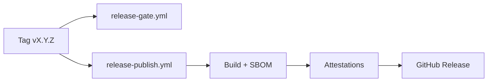

# GitHub-Settings — Vollständige Anleitung (CannaGuide 2025)

**Ziel:** Repository- und GitHub-Einstellungen so konfigurieren, dass Releases, CI, Cloud Agents und manuelle Workflows zuverlässig funktionieren — insbesondere wenn **Git-Tags blockiert** werden (`GH013: Cannot create ref due to creations being restricted`).

**Stand:** 2026-07-01 · Release **v1.9.0** bereit auf `main` (`25e3ce9e`), lokaler Tag `v1.9.0` existiert, **Remote-Tag fehlt** wegen Ruleset.

---

## Inhaltsverzeichnis

1. [Schnellstart: v1.9.0 jetzt veröffentlichen](#1-schnellstart-v190-jetzt-veröffentlichen)
2. [Tag Protection Ruleset (Hauptursache)](#2-tag-protection-ruleset-hauptursache)
3. [RELEASE_PAT einrichten (empfohlen)](#3-release_pat-einrichten-empfohlen)
4. [Release Publish Workflow](#4-release-publish-workflow)
5. [Branch Protection (`main`)](#5-branch-protection-main)
6. [GitHub Actions — Berechtigungen & Secrets](#6-github-actions--berechtigungen--secrets)
7. [Cursor Cloud Agent — Grenzen & Workarounds](#7-cursor-cloud-agent--grenzen--workarounds)
8. [PRs, Reviews & Merge-Policy](#8-prs-reviews--merge-policy)
9. [Security-Settings (Secret Scanning, Dependabot)](#9-security-settings-secret-scanning-dependabot)
10. [Checkliste nach jeder Änderung](#10-checkliste-nach-jeder-änderung)
11. [Fehlerdiagnose](#11-fehlerdiagnose)

---

## 1. Schnellstart: v1.9.0 jetzt veröffentlichen

### Option A — Empfohlen: `workflow_dispatch` + `RELEASE_PAT`

Wenn `RELEASE_PAT` als Repository-Secret gesetzt ist (siehe [Abschnitt 3](#3-release_pat-einrichten-empfohlen)):

1. **CI auf `main` grün** — [Actions](https://github.com/qnbs/CannaGuide-2025/actions) → letzter `main`-Run → **CI Status** = success
2. GitHub → **Actions** → **Release Publish** → **Run workflow**
3. Eingaben:
   - **tag:** `v1.9.0`
   - **dry-run:** `false`
4. Workflow erstellt den Tag, baut Tarball + SBOM, veröffentlicht GitHub Release

### Option B — Tag manuell als Repo-Owner pushen

Nur wenn dein Account das Tag-Ruleset **bypassen** darf (Owner mit Bypass-Rechten):

```bash
git fetch origin main
git checkout main
git pull origin main
# Tag zeigt auf den Release-Commit:
git tag -a v1.9.0 -m "v1.9.0: God-file splits, dbService refactor, AI disclaimers" 25e3ce9e
git push origin v1.9.0
```

→ Triggert automatisch `release-gate.yml` und `release-publish.yml`.

### Option C — Ruleset-Bypass für Actions

Ruleset **Tag Protection** → **Bypass list** → `github-actions[bot]` hinzufügen (siehe [Abschnitt 2](#2-tag-protection-ruleset-hauptursache)).

### Option D — Tag lokal erstellen, Release manuell

Wenn weder PAT noch Bypass funktionieren:

```bash
# Auf GitHub.com: Releases → Draft new release → Tag v1.9.0 → Target: main @ 25e3ce9e
gh release create v1.9.0 --repo qnbs/CannaGuide-2025 \
  --title "CannaGuide v1.9.0" \
  --notes-file CHANGELOG.md \
  --target 25e3ce9e
```

Assets (Tarball, SBOM) dann manuell hochladen oder `release-publish.yml` mit `dry-run: true` zum Bauen nutzen.

---

## 2. Tag Protection Ruleset (Hauptursache)

### Was blockiert wird

| Eigenschaft | Wert |
| ----------- | ---- |
| **Name** | Tag Protection |
| **ID** | `14231365` |
| **URL** | https://github.com/qnbs/CannaGuide-2025/rules/14231365 |
| **Target** | `tag` |
| **Pattern** | `refs/tags/v*` (alle Version-Tags `v1.x.x`, `v2.0.0`, …) |
| **Regeln** | `creation`, `update`, `deletion` — alle aktiv |
| **Bypass (aktuell)** | `current_user_can_bypass: never` für Cloud-Agent-Token |

**Fehlermeldung beim Push:**

```
remote: error: GH013: Repository rule violations found for refs/tags/v1.9.0.
remote: - Cannot create ref due to creations being restricted.
```

### Warum das so ist

Schutz vor versehentlichen oder unautorisierten Release-Tags. Sinnvoll für Supply-Chain-Sicherheit — erfordert aber einen **kontrollierten Bypass-Pfad** für Releases.

### Ruleset manuell anpassen

**Pfad:** Repository → **Settings** → **Rules** → **Rulesets** → **Tag Protection**

#### Variante 2a — Bypass-Liste (sicher, empfohlen)

Unter **Bypass list** hinzufügen:

| Actor | Zweck |
| ----- | ----- |
| `github-actions[bot]` | `release-publish.yml` kann Tags per `RELEASE_PAT` oder Bot-Bypass pushen |
| Dein persönlicher Account (`qnbs`) | Manuelle Tag-Pushes als Maintainer |
| Optional: GitHub App des Cursor Cloud Agents | Falls als dedizierter Actor sichtbar |

**Nicht** die Regeln komplett deaktivieren — nur gezielt bypassen.

#### Variante 2b — Regeln lockern (weniger sicher)

- `creation` nur für **Repository admin** erlauben
- `update` / `deletion` weiter blockieren

Nur wenn Bypass-Liste nicht ausreicht.

#### Variante 2c — Ruleset temporär deaktivieren

**Enforcement:** `Disabled` → Tag pushen → wieder `Active`. Nur als Notfall, nicht Dauerzustand.

---

## 3. RELEASE_PAT einrichten (empfohlen)

Der Workflow `release-publish.yml` nutzt optional ein Classic PAT, um Tag-Rulesets zu umgehen.

### PAT erstellen

1. GitHub → **Settings** (Profil, nicht Repo) → **Developer settings** → **Personal access tokens**
2. **Tokens (classic)** → **Generate new token (classic)**
3. Scopes: **`repo`** (Full control of private repositories)
4. Ablauf: z. B. 90 Tage oder „No expiration" (mit Rotation planen)
5. Token kopieren (nur einmal sichtbar)

### Als Repository-Secret speichern

1. Repository → **Settings** → **Secrets and variables** → **Actions**
2. **New repository secret**
3. Name: **`RELEASE_PAT`** (exakt so — Workflow referenziert diesen Namen)
4. Value: das Classic PAT einfügen

### Verifikation

```bash
# Secret ist gesetzt (Wert nicht lesbar):
gh secret list --repo qnbs/CannaGuide-2025 | grep RELEASE_PAT
```

Dann **Release Publish** → `workflow_dispatch` mit `tag: v1.9.0`.

### Sicherheitshinweise

- PAT nur mit `repo`-Scope, nicht `admin:org` o. Ä.
- Secret rotieren bei Verdacht auf Leak
- PAT-Account muss Schreibrechte auf das Repo haben
- Fine-grained PATs funktionieren nur, wenn **Contents: Read and write** + Tag-Bypass erlaubt ist

---

## 4. Release Publish Workflow

**Datei:** `.github/workflows/release-publish.yml`

### Trigger

| Event | Verhalten |
| ----- | --------- |
| `push: tags: ['v*']` | Parallel zu `release-gate.yml`; CI-Status-Guard prüft Checks |
| `workflow_dispatch` | Manuell; erstellt Tag wenn nicht vorhanden (**braucht `RELEASE_PAT`**) |

### Ablauf



### Wichtige Inputs bei manuellem Start

| Input | Wert für v1.9.0 |
| ----- | --------------- |
| `tag` | `v1.9.0` |
| `dry-run` | `true` zum Testen (kein Release), `false` zum Veröffentlichen |

### CI-Status-Guard

Bei Tag-**Push** (nicht `workflow_dispatch`): Workflow prüft, ob **CI Status** auf dem getaggten Commit `success` ist. Docs-only Commits ohne CI erzeugen eine Warnung, blockieren aber nicht.

---

## 5. Branch Protection (`main`)

Dokumentierter Zielzustand (Solo-Dev, CI-gated):

| Setting | Wert | UI-Pfad |
| ------- | ---- | ------- |
| `enforce_admins` | ✅ | Settings → Branches → `main` → Include administrators |
| PR required | ✅, 0 Approvals | Require pull request → 0 approving reviews |
| Required checks | `quality`, `ci-status` (strict) | Require status checks |
| Signed commits | ✅ | Require signed commits |
| Linear history | ✅ | Require linear history |
| Force push | ❌ | Block force pushes |
| Branch deletion | ❌ | Block deletions |

**Merge-Strategien** (Settings → General → Pull Requests):

| Setting | Wert |
| ------- | ---- |
| Squash merge | ✅ (einzige erlaubte) |
| Merge commit | ❌ |
| Rebase merge | ❌ |
| Auto-merge | ✅ |
| Delete branch on merge | ✅ |

### Direkt-Push auf `main`

Cloud Agents und Maintainer mit Admin-Bypass können `git push origin main` nutzen, wenn `enforce_admins` aktiv ist — **nur für Accounts mit Bypass**. CI muss danach grün sein.

---

## 6. GitHub Actions — Berechtigungen & Secrets

### Workflow permissions (Repository-Ebene)

**Pfad:** Settings → Actions → General → **Workflow permissions**

| Setting | Empfohlen |
| ------- | --------- |
| Default permissions | **Read repository contents** (least privilege) |
| Allow GitHub Actions to create PRs | Optional |

Einzelne Workflows setzen bei Bedarf `permissions: contents: write` (z. B. `release-publish.yml` im `release`-Job).

### Wichtige Repository-Secrets

| Secret | Zweck | Pflicht? |
| ------ | ----- | -------- |
| `RELEASE_PAT` | Tag-Push + Release bei Ruleset-Blockade | Für automatisierte Releases **ja** |
| `SNYK_TOKEN` | Wöchentlicher Snyk-Scan | Optional |
| `CLOUDFLARE_*` | Cloudflare Pages Deploy | Optional |
| Codespace/Signing-Keys | SSH-Commit-Signing | Optional |

### Actions-Allowlist

**Pfad:** Settings → Actions → General → **Allow specific actions**

Curated allowlist aktiv (nur vertrauenswürdige Actions). Neue `uses:`-Referenzen müssen SHA-gepinnt sein (Repo-Policy).

---

## 7. Cursor Cloud Agent — Grenzen & Workarounds

| Aktion | Cloud Agent | Workaround |
| ------ | ----------- | ---------- |
| `git push origin main` | ✅ (wenn Token Bypass hat) | Gates lokal, dann push |
| `git push origin v1.9.0` | ❌ Ruleset `never` bypass | `RELEASE_PAT` + `workflow_dispatch` oder manuell als Owner |
| `gh pr create` / ManagePullRequest | ❌ `Resource not accessible by integration` | Lokal mergen + `git push origin main` |
| `gh pr close` / Kommentare | ❌ gleicher Fehler | PRs manuell in GitHub UI schließen |
| Branch Protection lesen | ❌ 403 für Integration | Diese Anleitung + `gh api rulesets` |

### Offene PRs (manuell schließen)

| PR | Aktion |
| -- | ------ |
| #361 | Schließen — Fix in #360 (`cursor-cloud-update.sh`) |
| #363 | Schließen — Vitest-Fix auf `main` |
| #364 | Schließen — bereits in `main` gemergt |

Details: [`docs/audits/SUPERSEDED-PRS-2026-07-01.md`](./audits/SUPERSEDED-PRS-2026-07-01.md)

---

## 8. PRs, Reviews & Merge-Policy

### Solo-Developer-Setup

- **0 Required Approvals** — CI (`quality` + `ci-status`) ist das Gate
- **Signed commits** — SSH- oder GPG-Signing erforderlich
- **Squash-only** — lineare History

### Cloud-Agent-Branches

- Pattern: `cursor/<beschreibung>-4ff3` (oder `-671a` laut `AGENTS.md`)
- Push auf `cursor/**` triggert CI (siehe `.github/workflows/ci.yml`)

### Merge Gate (CI)

| Check | Required? |
| ----- | --------- |
| Quality Gates | ✅ |
| Security | ✅ |
| CI Status (Aggregator) | ✅ |
| E2E | Advisory |
| Deploy | Advisory (nach CI success) |

---

## 9. Security-Settings (Secret Scanning, Dependabot)

| Setting | Pfad | Status |
| ------- | ---- | ------ |
| Secret scanning | Settings → Code security | ✅ aktiv |
| Push protection | Secret scanning → Push protection | ✅ aktiv |
| Dependabot alerts | Settings → Code security → Dependabot | ✅ |
| Dependabot security updates | Automatische Fix-PRs | ✅ |
| CodeQL | `.github/workflows/codeql.yml` | Dispatch + Default |

---

## 10. Checkliste nach jeder Änderung

### Nach Ruleset-/PAT-Änderung

- [ ] `RELEASE_PAT` in Secrets sichtbar (Name, nicht Wert)
- [ ] `workflow_dispatch` Release Publish mit `dry-run: true` testen
- [ ] Echter Release: `dry-run: false`, Tag `v1.9.0`
- [ ] GitHub Release mit Tarball + SBOM vorhanden
- [ ] `gh attestation verify` gegen Release-Asset (optional)

### Nach Code-Merge auf `main`

- [ ] [Actions](https://github.com/qnbs/CannaGuide-2025/actions) → CI Status grün
- [ ] `docs/HOUSEKEEPING.md` Metriken aktuell
- [ ] `CHANGELOG.md` Versionseintrag

### Vor jedem Release

Siehe [`docs/release-process.md`](./release-process.md) Pre-Release Checklist.

---

## 11. Fehlerdiagnose

| Symptom | Ursache | Fix |
| ------- | ------- | --- |
| `GH013` Tag push rejected | Tag Protection Ruleset | Abschnitt 2 oder 3 |
| `RELEASE_PAT is required` im Workflow | Kein Secret bei `workflow_dispatch` | Secret anlegen (Abschnitt 3) |
| `Resource not accessible by integration` | Cloud-Agent Token-Scope | Manuell in UI oder Owner-Account |
| CI Status check failed bei Release | Tests/Lint rot auf Commit | Gates lokal fixen, neu taggen |
| `unknown_key` / unsigned commits | SSH-Key nicht registriert | GitHub → Settings → SSH keys |
| Docs-only: kein CI Status | `paths-ignore` in `ci.yml` | Code-Änderung oder `workflow_dispatch` |

### Nützliche Befehle

```bash
# Rulesets anzeigen
gh api repos/qnbs/CannaGuide-2025/rulesets

# Tag Protection Details
gh api repos/qnbs/CannaGuide-2025/rulesets/14231365

# Remote-Tags
git ls-remote --tags origin 'v*'

# Letzter main-Commit
git rev-parse origin/main
```

---

## Verwandte Dokumentation

- [`docs/release-process.md`](./release-process.md) — SemVer, CHANGELOG, Supply-Chain
- [`docs/HOUSEKEEPING.md`](./HOUSEKEEPING.md) — Pre-Release Checkliste
- [`AGENTS.md`](../AGENTS.md) — Cursor Cloud Agent Workflow
- [`.github/workflows/README.md`](../.github/workflows/README.md) — Workflow-Inventar
- [`docs/audits/AUDIT-REPORT-2026-07-01.md`](./audits/AUDIT-REPORT-2026-07-01.md) — v1.9.0 Audit
