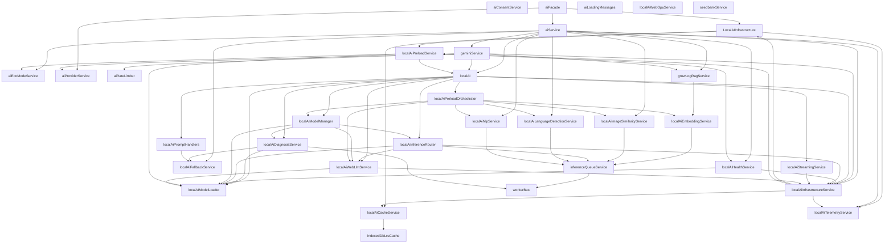

# AI Service Dependency Map

> Auto-generated by `scripts/generate-service-map.mjs`.
> Do not edit manually -- re-run the script to update.

```mermaid
flowchart TD
    LocalAIInfrastructure["LocalAIInfrastructure"]
    aiConsentService["aiConsentService"]
    aiEcoModeService["aiEcoModeService"]
    aiFacade["aiFacade"]
    aiLoadingMessages["aiLoadingMessages"]
    aiProviderService["aiProviderService"]
    aiRateLimiter["aiRateLimiter"]
    aiService["aiService"]
    geminiService["geminiService"]
    growLogRagService["growLogRagService"]
    indexedDbLruCache["indexedDbLruCache"]
    inferenceQueueService["inferenceQueueService"]
    localAI["localAI"]
    localAIModelLoader["localAIModelLoader"]
    localAiCacheService["localAiCacheService"]
    localAiDiagnosisService["localAiDiagnosisService"]
    localAiEmbeddingService["localAiEmbeddingService"]
    localAiFallbackService["localAiFallbackService"]
    localAiHealthService["localAiHealthService"]
    localAiImageSimilarityService["localAiImageSimilarityService"]
    localAiInferenceRouter["localAiInferenceRouter"]
    localAiInfrastructureService["localAiInfrastructureService"]
    localAiLanguageDetectionService["localAiLanguageDetectionService"]
    localAiModelManager["localAiModelManager"]
    localAiNlpService["localAiNlpService"]
    localAiPreloadOrchestrator["localAiPreloadOrchestrator"]
    localAiPreloadService["localAiPreloadService"]
    localAiPromptHandlers["localAiPromptHandlers"]
    localAiStreamingService["localAiStreamingService"]
    localAiTelemetryService["localAiTelemetryService"]
    localAiWebGpuService["localAiWebGpuService"]
    localAiWebLlmService["localAiWebLlmService"]
    seedbankService["seedbankService"]
    workerBus["workerBus"]

    LocalAIInfrastructure --> localAiCacheService
    LocalAIInfrastructure --> localAiTelemetryService
    LocalAIInfrastructure --> localAiPreloadService
    aiFacade --> aiService
    aiFacade --> aiProviderService
    aiFacade --> LocalAIInfrastructure
    aiService --> localAiHealthService
    aiService --> localAiInfrastructureService
    aiService --> localAiFallbackService
    aiService --> growLogRagService
    aiService --> aiEcoModeService
    aiService --> geminiService
    aiService --> localAI
    aiService --> localAiNlpService
    aiService --> localAiTelemetryService
    aiService --> localAiLanguageDetectionService
    aiService --> localAiImageSimilarityService
    geminiService --> growLogRagService
    geminiService --> aiRateLimiter
    geminiService --> aiProviderService
    geminiService --> localAiInfrastructureService
    geminiService --> localAI
    growLogRagService --> localAiEmbeddingService
    inferenceQueueService --> workerBus
    localAI --> localAiInfrastructureService
    localAI --> localAiStreamingService
    localAI --> localAiWebLlmService
    localAI --> localAiDiagnosisService
    localAI --> localAiPromptHandlers
    localAI --> localAIModelLoader
    localAI --> localAiInferenceRouter
    localAI --> localAiModelManager
    localAI --> localAiPreloadOrchestrator
    localAiCacheService --> indexedDbLruCache
    localAiDiagnosisService --> localAIModelLoader
    localAiDiagnosisService --> localAiFallbackService
    localAiDiagnosisService --> workerBus
    localAiEmbeddingService --> inferenceQueueService
    localAiHealthService --> localAIModelLoader
    localAiHealthService --> localAiInfrastructureService
    localAiImageSimilarityService --> inferenceQueueService
    localAiInferenceRouter --> localAiInfrastructureService
    localAiInferenceRouter --> inferenceQueueService
    localAiInferenceRouter --> localAiWebLlmService
    localAiInferenceRouter --> localAIModelLoader
    localAiInfrastructureService --> LocalAIInfrastructure
    localAiInfrastructureService --> localAiCacheService
    localAiInfrastructureService --> localAiTelemetryService
    localAiInfrastructureService --> localAiPreloadService
    localAiLanguageDetectionService --> inferenceQueueService
    localAiModelManager --> localAIModelLoader
    localAiModelManager --> localAiWebLlmService
    localAiModelManager --> localAiDiagnosisService
    localAiModelManager --> localAiInferenceRouter
    localAiNlpService --> inferenceQueueService
    localAiPreloadOrchestrator --> localAiWebLlmService
    localAiPreloadOrchestrator --> localAiModelManager
    localAiPreloadOrchestrator --> localAiEmbeddingService
    localAiPreloadOrchestrator --> localAiNlpService
    localAiPreloadOrchestrator --> localAiLanguageDetectionService
    localAiPreloadOrchestrator --> localAiImageSimilarityService
    localAiPreloadService --> localAI
    localAiPreloadService --> localAiHealthService
    localAiPreloadService --> localAIModelLoader
    localAiPreloadService --> aiEcoModeService
    localAiPromptHandlers --> localAiFallbackService
    localAiStreamingService --> localAiInfrastructureService
    localAiWebLlmService --> localAIModelLoader
    localAiWebLlmService --> localAiInfrastructureService
```
