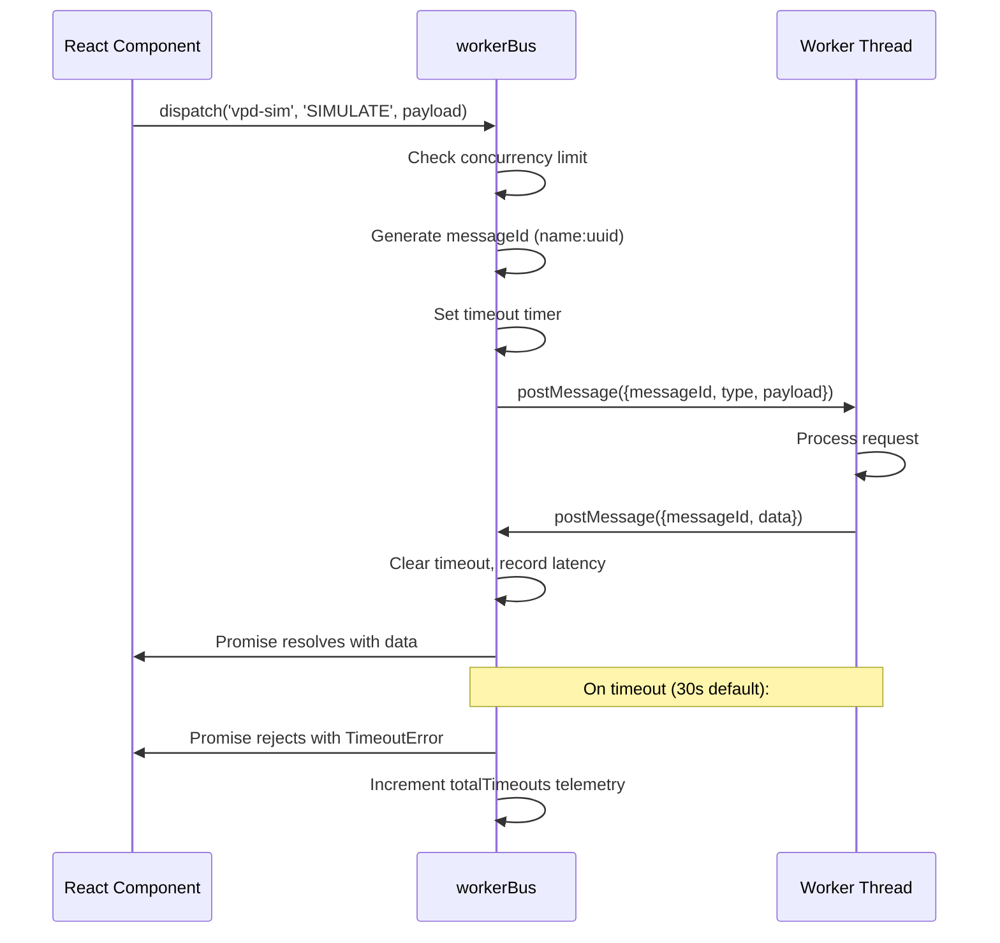

# WorkerBus -- Architecture & API Reference

<!-- markdownlint-disable MD024 -->

## Overview

`workerBus.ts` is the centralized, promise-based Web Worker communication dispatcher for CannaGuide 2025. It manages all 6 application workers through a single singleton instance, providing type-safe request/response messaging with automatic timeout, backpressure, retry, and telemetry.

**Location:** `apps/web/services/workerBus.ts`
**Types:** `apps/web/types/workerBus.types.ts`

## Architecture

```
Main Thread                              Worker Threads
-----------                              --------------
                                         [VPD Simulation]
[React UI] --> [workerBus.dispatch()] --> [Genealogy]
                    |                     [Scenarios]
                    |-- messageId tag     [Inference (ML)]
                    |-- timeout guard     [Image Generation]
                    |-- backpressure      [VPD Chart]
                    |-- retry logic
                    v
              [Pending Map]
              messageId -> {resolve, reject, timer}
```

## Message Protocol

Every message follows a strict request/response protocol:

```typescript
// Request (Main -> Worker)
interface WorkerRequest {
    messageId: string // Unique correlation ID (workerName:uuid)
    type: string // Action type (e.g. 'LAYOUT', 'SIMULATE')
    payload?: unknown // Typed per worker
}

// Response (Worker -> Main)
interface WorkerResponse {
    messageId: string // Must match request messageId
    data?: unknown // Result payload
    error?: string // Error message (mutually exclusive with data)
}
```

## Managed Workers

| Worker      | File                                | Purpose                    | Concurrency |
| ----------- | ----------------------------------- | -------------------------- | ----------- |
| `vpd-sim`   | `simulation.worker.ts`              | VPD environment simulation | Default (8) |
| `genealogy` | `workers/genealogy.worker.ts`       | Strain family tree layout  | Default (8) |
| `scenario`  | `workers/scenario.worker.ts`        | Grow scenario planning     | Default (8) |
| `inference` | `workers/inference.worker.ts`       | Local ML inference (ONNX)  | Default (8) |
| `image-gen` | `workers/imageGeneration.worker.ts` | SD-Turbo text-to-image     | Default (8) |
| `vpd-chart` | `workers/vpdChart.worker.ts`        | VPD chart data processing  | Default (8) |

## API Reference

### `workerBus.register(name, worker)`

Register a named Worker instance. Replaces existing worker with same name (terminates old one).

### `workerBus.dispatch<T>(name, type, payload?, options?)`

Send a request and get a Promise back. Options:

| Option         | Default | Description                         |
| -------------- | ------- | ----------------------------------- |
| `timeoutMs`    | 30000   | Per-request timeout override        |
| `retries`      | 0       | Retry attempts on transient failure |
| `retryDelayMs` | 500     | Base delay for exponential backoff  |

### `workerBus.unregister(name)`

Terminate worker. Rejects all pending + queued requests.

### `workerBus.dispose()`

Terminate ALL workers. Called automatically on `pagehide` event to prevent zombie workers.

### `workerBus.getMetrics(name?)`

Returns telemetry snapshot per worker:

```typescript
interface WorkerBusMetrics {
    totalDispatches: number
    totalErrors: number
    totalTimeouts: number
    pendingCount: number
    queuedCount: number
    averageLatencyMs: number
}
```

### `workerBus.has(name)` / `workerBus.getWorker(name)` / `workerBus.getPendingCount(name)`

Query helpers for worker state.

## Backpressure

When a worker reaches its concurrency limit (default: 8), further dispatches are queued (FIFO, max 64). Queued items drain automatically as in-flight requests complete. If the queue is full, dispatch rejects immediately with `Queue full`.

## Retry with Exponential Backoff

```typescript
// Retry 3 times with 500ms base delay (500, 1000, 2000ms)
await workerBus.dispatch('inference', 'CLASSIFY', data, {
    retries: 3,
    retryDelayMs: 500,
})
```

Non-retryable errors (worker missing, bus disposed, queue full) fail immediately without retry.

## Teardown / Cleanup

- `workerBus.dispose()` is called on `pagehide` event (registered in `index.tsx`)
- This prevents zombie workers on PWA background/close
- All pending promises are rejected with descriptive errors
- Telemetry maps are cleared

## Sequence Diagram



## Known Limitations & Future Work

### Current Limitations

- No Transferable Objects support yet -- large ML tensors / image buffers are copied (structured clone) instead of transferred. Could add overhead for image diagnosis and generation payloads.
- No per-worker-type rate limiting (e.g., inference max 3 req/s)
- No priority queue -- all dispatches are FIFO regardless of urgency
- No AbortController integration -- cannot cancel in-flight requests
- Telemetry is in-memory only (console/Sentry) -- no metric export interface
- No cross-worker communication (inference cannot query VPD data without main-thread hop)

### Planned Improvements

**Short-term (v1.2.0 stable):**

- SonarCloud review of workerBus.ts + all .worker.ts files
- Unit test coverage >95% for backpressure queue, retry edge cases, concurrent load
- Transferable Objects for ArrayBuffer/ImageBitmap payloads

**Mid-term (v1.3 -- Q2 2026):**

- AbortController + Priority Queue (high priority for VPD alerts)
- Dedicated workerTelemetry.ts export (Redux DevTools integration)
- Generic `WorkerMessage<T, R>` types for zero-runtime type checks
- Event emitter for real-time IoT sensor streaming
- Dynamic worker spawning (on-demand Three.js worker for 3D visualization)
- Cross-worker communication channel (SharedArrayBuffer or MessageChannel)

**Long-term (v2.0+):**

- Extract as `@cannaguide/worker-bus` open-source package
- WebGPU worker support + advanced ONNX Runtime integration
- AR/VR extension (Three.js + WorkerBus for real-time 3D plant rendering)
- Eco-Mode: Auto-throttle retry/backpressure on low-power devices
- Lighthouse CI assertion: TTI < 2s with 6 active workers
