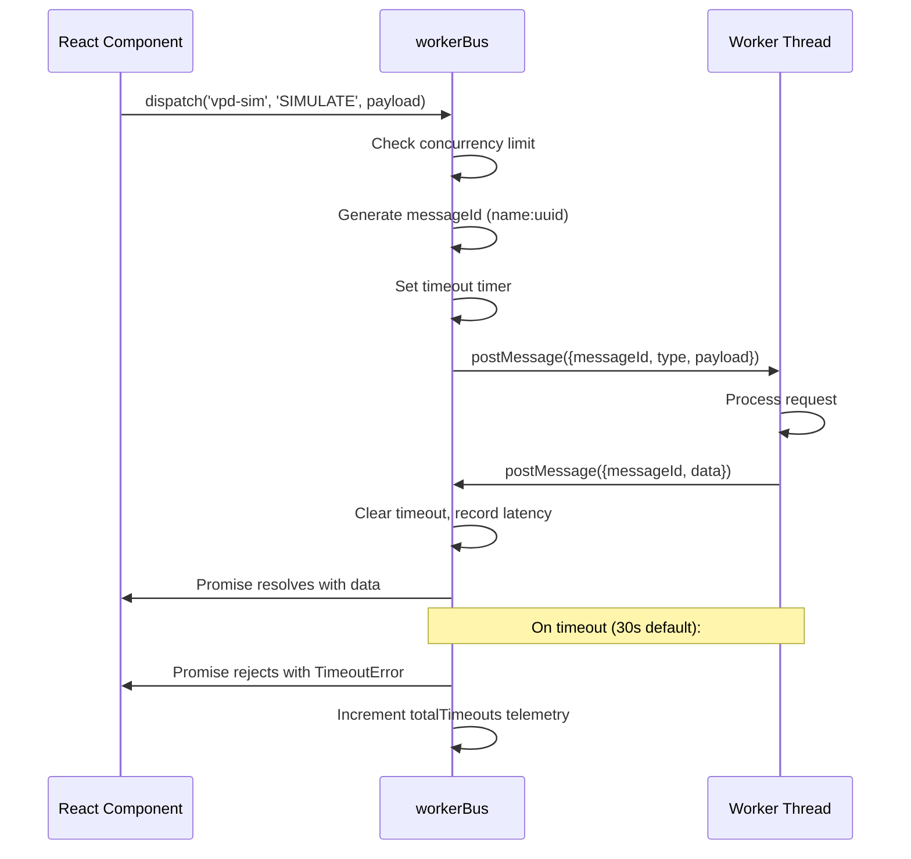

# WorkerBus -- Architecture & API Reference

<!-- markdownlint-disable MD024 -->

## Overview

`workerBus.ts` is the centralized, promise-based Web Worker communication dispatcher for CannaGuide 2025. It manages all 8 application workers through a single singleton instance, providing type-safe request/response messaging with automatic timeout, backpressure, retry, AbortController support, Transferable zero-copy transfers, and dispatch-complete hooks.

**Location:** `apps/web/services/workerBus.ts`
**Types:** `apps/web/types/workerBus.types.ts`

## Architecture

```
Main Thread                              Worker Threads
-----------                              --------------
                                         [VPD Simulation] <--+
[React UI] --> [workerBus.dispatch()] --> [Genealogy]        |
                    |                     [Scenarios]         | MessageChannel
                    |-- messageId tag     [Inference (ML)]    | (W-04)
                    |-- timeout guard     [Image Generation]  |
                    |-- backpressure      [Hydro Forecast]    |
                    |-- retry logic       [Terpene Analysis]  |
                    |-- AbortSignal       [Calculation]       |
                    v                     [Vision Inference] <+
              [Pending Map]
              messageId -> {resolve, reject, timer, abortCleanup}
                    |
                    v
          [onDispatchComplete hooks]
          --> workerStateSyncService
          --> workerTelemetryService
```

## Message Protocol

Every message follows a strict request/response protocol:

```typescript
// Request (Main -> Worker)
interface WorkerRequest {
    messageId: string // Unique correlation ID (workerName:uuid)
    type: string // Action type (e.g. 'LAYOUT', 'SIMULATE')
    payload?: unknown // Typed per worker
}

// Response (Worker -> Main)
interface WorkerResponse {
    messageId: string // Must match request messageId
    data?: unknown // Result payload
    error?: string // Error message (mutually exclusive with data)
    errorCode?: WorkerErrorCode // Structured error code for retry/cancel logic
}
```

`WorkerErrorCode` values: `UNKNOWN`, `TIMEOUT`, `NOT_REGISTERED`, `DISPOSED`, `QUEUE_FULL`, `EXECUTION_ERROR`, `INVALID_PAYLOAD`, `RESOURCE_UNAVAILABLE`, `OUT_OF_MEMORY`, `CANCELLED`.

## Managed Workers

| Worker             | File                                | Purpose                        | Concurrency |
| ------------------ | ----------------------------------- | ------------------------------ | ----------- |
| `vpd-sim`          | `simulation.worker.ts`              | VPD environment simulation     | Default (8) |
| `genealogy`        | `workers/genealogy.worker.ts`       | Strain family tree layout      | Default (8) |
| `scenario`         | `workers/scenario.worker.ts`        | Grow scenario planning         | Default (8) |
| `inference`        | `workers/inference.worker.ts`       | Local ML inference (ONNX)      | Default (8) |
| `image-gen`        | `workers/imageGeneration.worker.ts` | SD-Turbo text-to-image         | Default (8) |
| `terpene`          | `workers/terpene.worker.ts`         | Terpene profile analysis       | Default (8) |
| `calculation`      | `workers/calculation.worker.ts`     | VPD/EC/light math offload      | Default (8) |
| `hydro-forecast`   | `workers/hydroForecastWorker.ts`    | ONNX hydro pH/EC/Temp forecast | Default (8) |
| `vision-inference` | `workers/visionInferenceWorker.ts`  | PlantVillage leaf diagnosis    | Default (8) |
| `voice`            | `workers/voiceWorker.ts`            | Voice transcript processing    | Default (8) |
| `vpd-simulation`   | `workers/vpdSimulation.worker.ts`   | VPD simulation (worker dir)    | Default (8) |

## API Reference

### `workerBus.register(name, worker)`

Register a named Worker instance. Replaces existing worker with same name (terminates old one).

### `workerBus.dispatch<T>(name, type, payload?, options?)`

Send a request and get a Promise back. Options:

| Option         | Default    | Description                                                |
| -------------- | ---------- | ---------------------------------------------------------- |
| `timeoutMs`    | 30000      | Per-request timeout override                               |
| `retries`      | 0          | Retry attempts on transient failure                        |
| `retryDelayMs` | 500        | Base delay for exponential backoff                         |
| `signal`       | --         | `AbortSignal` to cancel the request (rejects CANCELLED)    |
| `transferable` | --         | `Transferable[]` for zero-copy ArrayBuffer/ImageBitmap     |
| `priority`     | `'normal'` | `WorkerPriority` -- `critical`, `high`, `normal`, or `low` |

### `workerBus.unregister(name)`

Terminate worker. Rejects all pending + queued requests.

### `workerBus.dispose()`

Terminate ALL workers. Called automatically on `pagehide` event to prevent zombie workers.

### `workerBus.getMetrics(name?)`

Returns telemetry snapshot per worker:

```typescript
interface WorkerBusMetrics {
    totalDispatches: number
    totalErrors: number
    totalTimeouts: number
    pendingCount: number
    queuedCount: number
    averageLatencyMs: number
}
```

### `workerBus.has(name)` / `workerBus.getWorker(name)` / `workerBus.getPendingCount(name)`

Query helpers for worker state.

## Priority Queue

Every dispatch accepts an optional `priority` field (`WorkerPriority`). When a worker is at its concurrency limit, queued items are stored in a min-heap (`PriorityQueue<T>` from `utils/priorityQueue.ts`) ordered by priority value (`critical=0 < high=1 < normal=2 < low=3`). Items with equal priority are dequeued in FIFO order via a monotone `insertOrder` counter.

```typescript
// VPD safety-critical -- always next in queue
await workerBus.dispatch('vpd-sim', 'RUN_DAILY', payload, { priority: 'critical' })

// ML inference -- yields to higher-priority work
await workerBus.dispatch('inference', 'INFER', task, { priority: 'low' })
```

**Priority Preemption (W-02):** When all worker slots are full and a higher-priority job arrives, the lowest-priority running job is preempted and automatically re-queued. See [Priority Preemption](#priority-preemption-w-02) below.

### Default Priority Assignments

| Consumer                  | Priority   | Rationale                      |
| ------------------------- | ---------- | ------------------------------ |
| VPD simulation            | `critical` | Plant safety alerts            |
| Plant simulation (growth) | `high`     | User-initiated grow simulation |
| Scenario planning         | `normal`   | Background scenario runs       |
| ML inference              | `low`      | Bulk inference, can wait       |
| Image generation          | `low`      | Non-urgent creative task       |
| All others (default)      | `normal`   | When no priority is specified  |

### `workerBus.getQueueState()`

Inspect in-flight and queued dispatches with per-priority breakdown:

```typescript
const state = workerBus.getQueueState()
// state.current: Array<{ workerName, type, priority }>
// state.queued: Array<{ workerName, type, priority }>
// state.byPriority: { critical: 1, high: 0, normal: 3, low: 2 }
```

## Backpressure

When a worker reaches its concurrency limit (default: 8), further dispatches are queued in the priority heap (max 64). Queued items drain automatically as in-flight requests complete, with the highest-priority item dequeued first. If the queue is full, dispatch rejects immediately with `Queue full`.

## Priority Preemption (W-02)

When all concurrency slots for a worker are occupied and a **strictly higher-priority** job arrives, the bus preempts the lowest-priority running job:

1. The preempted job's `PendingRequest` is removed from the pending map (its eventual worker response is silently ignored).
2. The slot is freed and the higher-priority job is dispatched immediately.
3. The preempted job is automatically re-queued with its original `resolve`/`reject` preserved, so the caller's promise resolves transparently when the job eventually completes.
4. A job can be preempted at most 3 times (`MAX_PREEMPTION_RETRIES`). After that, it is rejected with `WorkerErrorCode.PREEMPTED`.

**Rules:**

- Preemption requires **strict** priority difference -- equal priority never triggers preemption.
- `PREEMPTED` is a non-retryable error code.
- Telemetry: `preemptionCount` is tracked per-worker in `getMetrics()` and `exportTelemetry()`.

```typescript
// VPD critical dispatch preempts a running low-priority ML inference job:
const pInference = workerBus.dispatch('inference', 'CLASSIFY', data, { priority: 'low' })
const pVpd = workerBus.dispatch('inference', 'VPD_CHECK', alert, { priority: 'critical' })
// -> inference job is preempted, VPD runs immediately, inference resumes after
```

See [ADR-0007](adr/0007-workerbus-priority-preemption.md) for the design decision.

## Retry with Exponential Backoff

```typescript
// Retry 3 times with 500ms base delay (500, 1000, 2000ms)
await workerBus.dispatch('inference', 'CLASSIFY', data, {
    retries: 3,
    retryDelayMs: 500,
})
```

Non-retryable errors (worker missing, bus disposed, queue full) fail immediately without retry.

## P1 Features (v1.3.0)

### AbortController Support

Cancel in-flight or queued requests via `AbortSignal`:

```typescript
const ctrl = new AbortController()

// Start a long-running dispatch
const promise = workerBus.dispatch('inference', 'CLASSIFY', data, {
    signal: ctrl.signal,
    timeoutMs: 60_000,
})

// Cancel at any time -- rejects with WorkerErrorCode.CANCELLED
ctrl.abort()
await promise.catch((err) => console.debug(err.code)) // 'CANCELLED'
```

Pre-flight abort (signal already aborted when `dispatch` is called) rejects synchronously. Mid-flight abort is handled via `addEventListener('abort', ..., { once: true })` with cleanup on settlement.

### Transferable Objects

Move ArrayBuffer/ImageBitmap ownership into the worker thread to avoid expensive structured-clone copies:

```typescript
const buffer = new ArrayBuffer(4 * 1024 * 1024) // 4 MB image data
const result = await workerBus.dispatch('image-gen', 'PROCESS', buffer, {
    transferable: [buffer],
})
// buffer is now detached (owned by worker thread)
```

### onDispatchComplete Hook

Subscribe to every settled dispatch (success or failure) for side-effects without touching the call site:

```typescript
// Returns a cleanup function
const cleanup = workerBus.onDispatchComplete((event) => {
    console.debug(event.workerName, event.type, event.latencyMs, event.success)
})

// Remove the hook later
cleanup()
```

`DispatchCompleteEvent` fields: `workerName`, `type`, `priority`, `latencyMs`, `success`, `data?`, `error?`.

### workerStateSyncService

`services/workerStateSyncService.ts` provides a framework-agnostic handler registry that connects WorkerBus results to Redux/Zustand without manual `await then dispatch` patterns:

```typescript
// Register once in a feature initializer:
registerWorkerResultHandler('vpd-sim', 'SIMULATE', (data, ctx) => {
    reduxDispatch(updateSimulationResult(data))
})

// Now every workerBus.dispatch('vpd-sim', 'SIMULATE', ...) automatically
// calls the handler -- no extra code at the call site.
```

Initialized via `initWorkerStateSync()` in `index.tsx` after store hydration.

### workerTelemetryService + workerMetricsSlice

`services/workerTelemetryService.ts` connects WorkerBus dispatch-complete events to:

1. **Redux DevTools** -- debounced 5s metrics snapshot via `workerMetricsSlice`
2. **Sentry** -- alert when any worker error rate exceeds 10%

`stores/slices/workerMetricsSlice.ts` is runtime-only (not persisted to IndexedDB).

## Teardown / Cleanup

- `workerBus.dispose()` is called on `pagehide` event (registered in `index.tsx`)
- This prevents zombie workers on PWA background/close
- All pending promises are rejected with descriptive errors
- Telemetry maps are cleared

## Sequence Diagram



## Known Limitations & Future Work

### Current Limitations

- No channel telemetry (port messages are off main-thread, not observable)
- Workers must implement `__PORT_TRANSFER__` handler to use cross-worker channels

### Resolved (v1.5)

- ~~No per-worker-type rate limiting~~ -- DONE (W-01, Session 94): `setRateLimit()` sliding-window API
- ~~Telemetry Redux DevTools only~~ -- DONE (W-03, Session 94): `exportTelemetry()` + Sentry context
- ~~Priority is queue-order only (no preemption)~~ -- DONE (W-02): AbortController-based preemption + re-queue
- ~~No cross-worker communication~~ -- DONE (W-04): MessageChannel-based `createChannel()` / `closeChannel()` + generic typed dispatch (ADR-0008)

### Planned Improvements

**Short-term:**

- Unit test coverage >95% for backpressure queue, retry edge cases, concurrent load
- ~~Generic `WorkerMessage<T, R>` types for zero-runtime type checks~~ -- DONE (W-04): `WorkerMessageMap` + typed dispatch overloads

**Mid-term (v1.6):**

- ~~Priority Queue (high priority for VPD alerts)~~ -- DONE (Session 60)
- ~~W-01: Per-worker-type rate limiting~~ -- DONE (Session 94)
- ~~W-03: External telemetry export~~ -- DONE (Session 94)
- ~~W-02: Priority preemption for running workers~~ -- DONE (ADR-0007)
- ~~W-04: Cross-worker communication channel (SharedArrayBuffer or MessageChannel)~~ -- DONE (ADR-0008): MessageChannel chosen over SharedArrayBuffer (COOP/COEP incompatible)
- ~~W-01.1: Dynamic Concurrency~~ -- DONE: `deviceCapabilities.ts` auto-scales concurrency per hardware
- ~~W-02.1: Cooperative Preemption~~ -- DONE: All 11 workers use `workerAbort.ts` + `__CANCEL__` protocol
- ~~W-03 COEP: SharedArrayBuffer enablement~~ -- DONE (ADR-0009): COEP `credentialless` on Netlify/Vercel/Cloudflare
- ~~W-04.1: AtomicsChannel~~ -- DONE: Lock-free Int32 signaling via SAB + Atomics (progressive enhancement)
- ~~W-05: Lock-free Ring Buffer~~ -- DONE: SPSC ring buffer for high-frequency data streaming
- Event emitter for real-time IoT sensor streaming
- Dynamic worker spawning (on-demand Three.js worker for 3D visualization)

**Long-term (v2.0+):**

- Extract as `@cannaguide/worker-bus` open-source package
- WebGPU worker support + advanced ONNX Runtime integration
- AR/VR extension (Three.js + WorkerBus for real-time 3D plant rendering)
- Eco-Mode: Auto-throttle retry/backpressure on low-power devices

---

## W-01.1: Dynamic Concurrency

**File:** `apps/web/utils/deviceCapabilities.ts`

Concurrency limits are auto-detected based on device hardware at worker registration time:

- Formula: `Math.floor(navigator.hardwareConcurrency * 0.6)` clamped to [2, 12]
- Battery-aware: `getAdaptiveConcurrencyLimit()` halves the limit below 20% battery
- Configurable: `workerBus.setDynamicConcurrency(false)` disables auto-detection
- Telemetry: `getMetrics()` returns `concurrencyLimit` per worker

## W-02.1: Cooperative Preemption

**Files:**

- `apps/web/utils/workerAbort.ts` -- Worker-side abort tracking
- `apps/web/services/workerBus.ts` -- Main-thread CANCEL signal dispatch

When a higher-priority job preempts a running job:

1. WorkerBus sends `{ type: '__CANCEL__', messageId }` to the worker
2. `initAbortHandler()` intercepts the message and marks the messageId
3. Worker calls `checkAborted(messageId)` in loops -- throws 'CANCELLED' if aborted
4. Worker's error handler sends `workerErr(messageId, 'CANCELLED')` back
5. WorkerBus detects cooperative cancellation and increments `cooperativePreemptions`

All 11 workers are updated with `initAbortHandler()`. Workers with long loops
(scenario, vpdSimulation, imageGeneration, terpene) have `checkAborted()` calls
inside their processing loops for early termination.

## W-03: SharedArrayBuffer (Progressive Enhancement)

**Files:**

- `apps/web/utils/crossOriginIsolation.ts` -- Feature detection
- `apps/web/utils/sharedBufferPool.ts` -- SAB/ArrayBuffer pool
- `docs/adr/0009-sharedarraybuffer-progressive-enhancement.md`

COEP `credentialless` is deployed on Netlify/Vercel/Cloudflare Pages, enabling
SharedArrayBuffer where COOP `same-origin` is already present. GitHub Pages
cannot serve custom headers, so all SAB consumers fall back to ArrayBuffer.

Detection: `canUseSharedArrayBuffer()` checks `self.crossOriginIsolated` + SAB constructor.

## W-04.1: AtomicsChannel

**File:** `apps/web/utils/atomicsChannel.ts`

Lock-free bidirectional signaling between main thread and worker:

- 8 Int32 slots on SharedArrayBuffer (2 signal + 6 data)
- `Atomics.store/load` for zero-copy reads/writes
- `Atomics.notify/wait` for efficient wake-up (worker-side blocking only)
- Falls back to null when SAB is unavailable

## W-05: Lock-Free Ring Buffer

**File:** `apps/web/utils/lockFreeRingBuffer.ts`

Single-Producer Single-Consumer (SPSC) ring buffer on SharedArrayBuffer:

- Power-of-2 capacity for O(1) modular arithmetic (bitmask)
- `push()`/`pop()` with Atomics when SAB available, plain Int32Array otherwise
- `pushBatch()`/`popBatch()` for bulk operations
- `waitForData()` (worker-side Atomics.wait) for blocking consumers
- Falls back to ArrayBuffer-backed mode transparently
